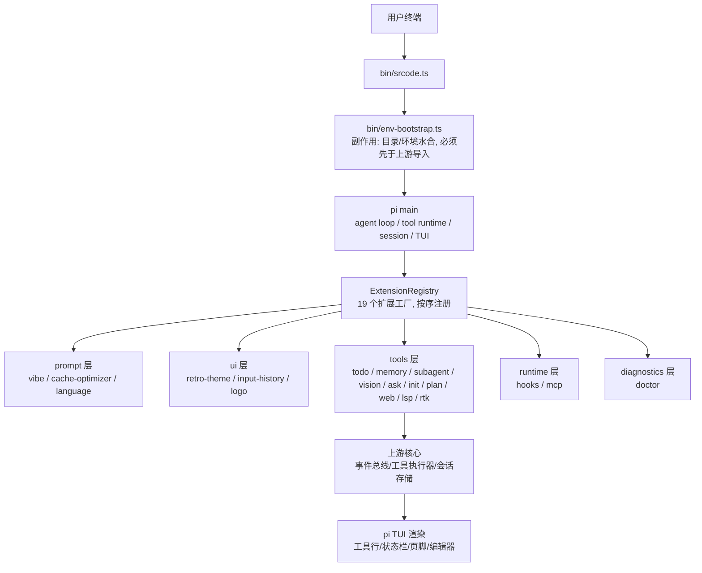
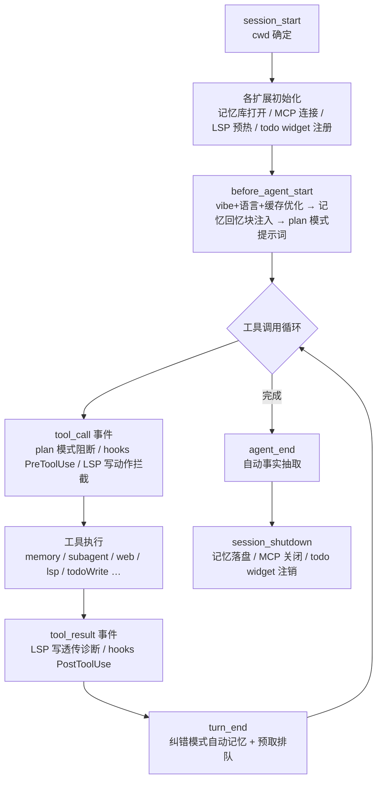
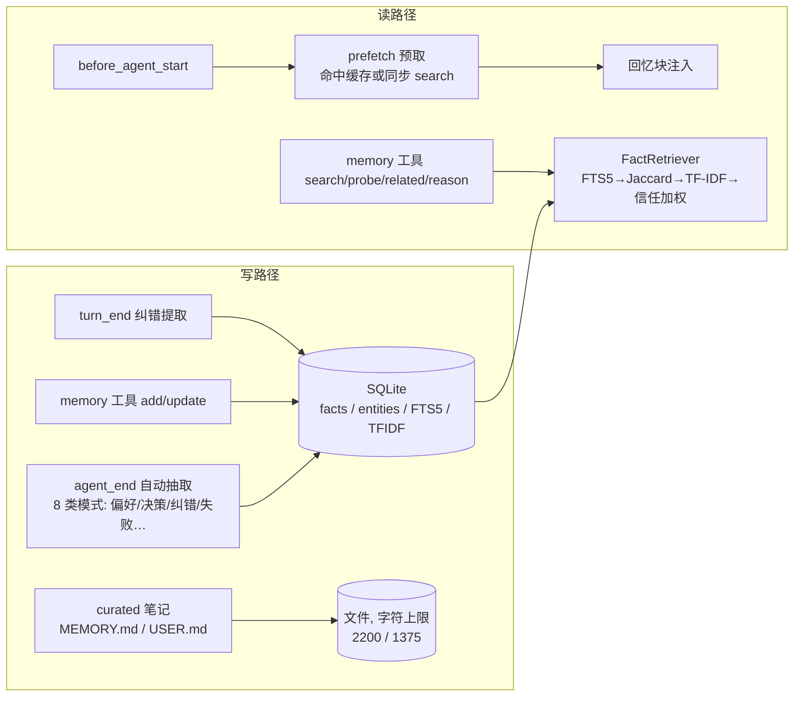
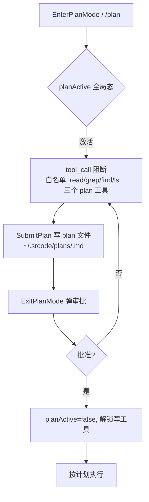

# srcode 项目技术总结与复盘（内部归档）

| 项 | 值 |
|---|---|
| 适用范围 | 研发 / 后端 / 运维 / 项目成员 |
| 密级 | 内部，不对外 |
| 版本基线 | 2026-08-02（`fd04fff` / `10fba51` 整改后） |
| 测试基线 | `bun run verify`：385 用例 / 26 文件，tsc --noEmit 0 错误 |
| 用途 | 信息对齐、技术沉淀、流程复盘、新人接手参考 |

---

## 1. 项目定位与架构总览

### 1.1 定位

srcode 是基于 `@earendil-works/pi-coding-agent`（下文简称 pi）的 **thin wrapper** 型终端编码代理。上游提供 agent loop、tool runtime、session 管理、TUI；srcode 通过扩展工厂注入产品化能力（记忆、子代理、任务清单、计划模式、网络、LSP 等），不 fork 上游核心。

设计原则：

- **不侵入上游**：所有功能通过 `ExtensionFactory` 插件注入，扩展之间通过事件链解耦，禁止扩展间直接 import；
- **薄适配层**：`bin/` + `src/runtime/` 只做参数装配与入口编排；
- **零额外依赖**：测试用 `bun:test` + hand-rolled fakes；无 ESLint/Prettier；`@earendil-works/*` 为唯一上游系。

### 1.2 技术栈与选型

| 项 | 选型 | 理由 |
|---|---|---|
| 运行时 | Bun（非 Node） | 单二进制交付、内建 SQLite / spawn / TUI 生态 |
| 语言 | TypeScript（strict、verbatimModuleSyntax、noUncheckedIndexedAccess） | 上游同栈，类型面干净 |
| 存储 | bun:sqlite（WAL + FTS5） | 零依赖全文检索 + 事务 |
| 语义检索 | TF-IDF 稀疏向量（纯 TS，存 JSON 列） | 替代 hermes 的 HRR numpy 依赖，离线可跑 |
| 测试 | bun:test，`__reset*ForTests()` 钩子 + `SRCODE_HOME` 临时目录隔离 | 完全离线、无 mock 库 |
| 构建 | `scripts/build.ts` 三阶段（嵌入资源 → `bun build --compile` → package.json） | 产物为 ~102MB 独立二进制 |

### 1.3 整体架构



**入口链**（顺序敏感）：

```
bin/srcode.ts
  → bin/env-bootstrap.ts   // 必须最先导入：设置 PI_CODING_AGENT_DIR 等
  → buildRuntimeArgs()     // 自动注入 --prompt-template / --skill（可 -np/-ns 关闭）
  → runSetupCommandIfRequested()  // 包管理命令短路
  → main(args, { extensionFactories })
```

**编译二进制模式**：`prepareEmbeddedRuntime()` 把嵌入资源（prompts/skills/themes/agents）解包到 `$TMPDIR/srcode-<rand>`，注册 exit/SIGINT/SIGTERM 清理，并设置 `PI_PACKAGE_DIR` 指向解包目录。

### 1.4 扩展注册顺序与依赖约束

注册顺序：`vibe → cache-optimizer → todo → retro-theme → language → input-history → logo → memory → subagent → vision → ask → init → plan → web → lsp → rtk → hooks → mcp → doctor`（**19 个**；AGENTS.md 写"18 个"，存在文档漂移，见 §5.2）。

`ExtensionRegistry.validate()` 强制：名称唯一、`dependsOn` 只能引用已注册扩展（目前仅 logo → retro-theme）。`before_agent_start` 等事件处理器按注册顺序链式合并返回值，因此 **cache-optimizer 先于 memory 改写 systemPrompt**，动态回忆块不会被静态化到缓存前缀。

---

## 2. 业务链路与任务生命周期

### 2.1 一次任务的完整生命周期



关键时序事实（代码证据）：

- **todoWrite 每次全量替换**：`TodoStore.commit` 以 session id 为 key 全量覆盖，全 completed 自动折叠清空；id 缺失/重复由 store 自动分配并回报模型。
- **记忆写路径异步化**：`WriteQueue`（微任务 FIFO）承载 `syncTurn`/`queuePrefetch` 等后台工作，主 turn 路径不被阻塞；`session_shutdown` 时 `flushPending(2000ms)` 兜底。
- **`/reload` 语义**：pi 先发 `session_shutdown(reason:"reload")` 并调用 `resetExtensionUI()` 清空扩展 widget，再重发 `session_start(reason:"reload")`。扩展侧必须在这两个事件中做对称清理（todo widget 曾因此丢失注册，见 §4.5）。

### 2.2 事件驱动扩展模型

扩展通过 `pi.on(event, handler)` 挂接生命周期：`before_agent_start → session_start → tool_call → tool_result → turn_end → agent_end`。`before_agent_start` 处理器返回 `{ systemPrompt }` 会被链式合并；`tool_call` 返回 `{ block: true, reason }` 可阻断工具。

扩展间通过 `events.ts` 总线解耦（当前仅 `subagent_completed` 一个事件，memory 消费它做委派追踪）。注意：**事件总线不隔离订阅者异常**——单个订阅者抛错会中断后续订阅者并传播给发布方（§4.5 已修复为逐 handler try/catch）。

---

## 3. 核心模块设计与实现

### 3.1 长期记忆子系统（memory）



实现要点：

- **存储**：`facts`（UNIQUE content、trust_score、scope、correction_of、source）+ `entities`/`fact_entities`（实体链接，支撑 probe/related/reason）+ `facts_fts`（FTS5 触发器同步）+ `tfidf_vector`（JSON 稀疏向量）。
- **scope 隔离**：`global` 与 `project:<cwd>` 双 scope；所有读路径（search/probe/related/reason/list）统一经 `scopeFilter` 过滤；`contradict` 在整改前**漏加 scope 过滤**（跨项目事实泄漏，§4.4 已修复）。
- **信任机制**：feedback ±0.05/-0.10 钳制 [0,1]；`correction_of` 惩罚原事实 -0.30 且新事实以 0.70 起步；检索排序乘信任分。
- **纠错检测**：`turn_end` 对用户消息跑 `CORRECTION_PATTERNS`，命中即写入 correction 类事实 + curated 笔记（截断 400 字符）。
- **秘密扫描**：写前 `scanSecrets`（AWS/GitHub/SSH/Stripe/Google key 等模式），命中即拒绝入库；curated 快照注入时对含秘密条目打 `[BLOCKED]` 占位。
- **provider 抽象**：`MemoryProvider` 接口 + `ProviderManager` 注册表（`registerMemoryProviderFactory`）；内置 `builtin`（SQLite）与 `holographic`（**demo stub**，JSON 全量读写，related/reason/contradict 空实现）。
- **路径隔离**：`SRCODE_MEMORY_DB` 只作用于 SQLite；holographic 使用独立 `SRCODE_HOLOGRAPHIC_MEMORY_PATH`（整改前两后端共用同一 env，存在互覆写风险，§4.4）。

### 3.2 子代理编排（subagent）

```mermaid
flowchart TD
    REQ[subagent 工具调用] --> MODE{模式判定, 必须恰一种}
    MODE --> S[单代理<br/>agent+task]
    MODE --> P[并行<br/>tasks[], ≤8 个, 并发 4]
    MODE --> C[链式<br/>chain[], {previous}/{outputs.x} 占位]
    S --> GATE[项目代理门禁<br/>交互确认 / 非交互需 env 放行]
    P --> WT{isolation=worktree?}
    WT -- 是 --> W[git worktree 隔离<br/>合并前强制提交未提交改动]
    C --> F[fallback 回退链<br/>provider 错误 → fallbackModels]
    F --> ACC[acceptance gate<br/>evidence 命令 + criteria + selfRepair]
    ACC --> PUB[publish subagent_completed<br/>→ memory 委派追踪]
```

实现要点：

- **进程模型**：子代理为独立进程 `srcode --mode json -p "Task: …"`；stdout 按行解析 `message_end`/`tool_result_end` JSON 事件流；SIGTERM 5s 后 SIGKILL 升级；stderr 累积进结果（**无界**，见 §5.2）。
- **临时提示词**：agent 的 systemPrompt 写入 `$TMPDIR/srcode-subagent-*`（0o600），finally 清理。
- **frontmatter 契约**：`model/tools/thinking/maxExecutionTimeMs/maxTokens/fallbackModels/systemPromptMode/inheritProjectContext/inheritSkills/outputMode/acceptance`。整改前三个开关字段（systemPromptMode/inheritProjectContext/inheritSkills）**解析但从未生效**，已映射到 `--system-prompt`/`--no-context-files`/`--no-skills`（§4.1）。
- **验收门**：`acceptance.evidence` 命令在**主进程**以 `execSync`（60s 超时）执行；`selfRepair` 循环重试；criteria 与 evidence **按下标配对**（设计脆弱点，见 §5.2）。整改前 fallback 模型成功路径绕过验收门（§4.2）。
- **项目代理安全门禁**：`.srcode/agents/*.md` 为仓库可控代码（可含任意 evidence 命令）。交互模式弹确认；非交互模式**默认拒绝**，需 `SRCODE_ALLOW_UNATTENDED_PROJECT_AGENTS=1`（整改前 `hasUI` 为 false 时整个确认被跳过，§4.3）。
- **worktree 模式**：并行任务各自 `git worktree add --detach` + 命名分支；合并前先 `git add -A && commit`（注入 `srcode-subagent` 身份），否则未提交改动随 worktree 删除而丢失（§4.4）。

### 3.3 会话任务清单（todo）

- 进程内 `Map<sessionKey, Todo[]>`，**不落盘**（有意设计：跨会话不恢复，逼模型重新排优先级）。
- `todoWrite` 全量替换语义；`multipleInProgress`/`duplicateIds` 不变量以 warning 形式回报模型。
- widget 为 `setWidget` 组件：可见窗口锚定首个非 completed 任务，F7 切换，`openContent` 集合区分"真新任务"与"id 重写"（防止模型换 id 重写同批任务时面板反复弹出）。

### 3.4 计划模式（plan）



要点：进程级单开关（有意为之，一个进程一个 plan 态）；非交互模式需 `SRCODE_ALLOW_UNATTENDED_PLAN_APPROVAL=1` 才能自动批准；session 切换/分叉时重置（整改后，防止旧会话 plan 文件串台）。

### 3.5 Web 搜索与抓取（web）

- **webSearch**：默认 Exa MCP 端点（JSON-RPC 2.0，兼容 SSE 分帧）；有 `TAVILY_API_KEY` 时 hybrid 并行合并（URL 去重）；`SRCODE_SEARCH_PROVIDER=exa|tavily` 强制单源，**强制但缺 key/非法值 → 显式报错**（整改前静默降级，§4.3）。单请求 15s 超时（headers+body 同一作用域）。
- **webFetch**：http→https 升级、**手动重定向**（每跳复检私网）、私网防护（IPv4 段 / IPv6 ULA / mapped-IPv6 / 整数与十六进制 IP 写法）、1MiB body 上限、8KiB 输出截断（UTF-8 边界回退）、15min/50 条 LRU、同 URL 并发合并（single-flight）。4xx/5xx **不缓存**且 `isError=true`（整改后）。
- 已知残留：防护仅字符串级 hostname 判定，`*.nip.io` 类 DNS 重绑定域名可绕过（见 §5.2）。

### 3.6 LSP 代码智能（lsp）

- 统一 `lsp` 工具 + `action` 路由：hover/definition/references/diagnostics/symbols/code_actions/capabilities/status 只读；rename/rename_file/reload/request 及 code_actions apply=true 由 `isLspWriteOrHighRiskInput` **双层阻断**（execute 入口 + tool_call hook）。
- 懒启动 + session_start 预热；`ensureServer` 有 initializing 在途复用（整改后，消除并发双 spawn 孤儿进程）；初始化失败统一 `client.shutdown()` 回收进程（整改后）。
- 写透传：edit/write 后 `didSave` → 500ms 内联 + 5s 上限的诊断等待（整改前 25.5s 阻塞 turn，§4.5），经 `DiagnosticsLedger` 去重后追加进 tool_result（identity 保留行号，整改后）。
- `formatOnWrite` 受 `SRCODE_ALLOW_LSP_FORMAT_ON_WRITE` 双重管控（policy + 执行点）。
- 已知残留：诊断等待仍为轮询窗口而非事件驱动；prewarm 已改用 `guessLanguageId` 规范映射（整改后）。

### 3.7 安全策略（policy）

四个安全开关，统一解析链：**env（1/true/yes/on）→ settings.json `safety` 字段 → 默认拒绝**：

| 开关 | env | 作用点 |
|---|---|---|
| 计划自动批准 | `SRCODE_ALLOW_UNATTENDED_PLAN_APPROVAL` | plan ExitPlanMode |
| LSP 写后格式化 | `SRCODE_ALLOW_LSP_FORMAT_ON_WRITE` | lsp 写透传 |
| 项目级 hooks | `SRCODE_ENABLE_PROJECT_HOOKS` | hooks 配置加载 |
| 项目级 MCP | `SRCODE_ENABLE_PROJECT_MCP` | mcp 配置加载 |
| 非交互项目代理（env-only） | `SRCODE_ALLOW_UNATTENDED_PROJECT_AGENTS` | subagent 门禁 |

### 3.8 构建与发布

三阶段：**① 嵌入资源生成**（`src/generated/embedded-assets.ts`，prompts/skills/themes/agents 打包进二进制）→ **② `bun build --compile`**（~102MB 单文件）→ **③ 生成 build/package.json**（`piConfig.name="srcode"`，使上游读 `SRCODE_CODING_AGENT_DIR`）。产物旁需要 prompts/agents 目录（编译模式由嵌入式资源提取兜底，见 §6.2）。

---

## 4. 开发过程难点、坑点与解决方案

以下为审查与整改阶段确认的真实问题（均已在 `fd04fff` / `10fba51` 修复并附回归测试）。

### 4.1 运行时与 IO 语义

**坑 1：Bun 管道 stdin 写入不自动 flush —— MCP 全链路不可用（高）**
- 现象：MCP 所有 JSON-RPC 请求 30s 超时；`client.ts` 写入后注释写着 "Flush and wait for response" 但无任何 flush 调用。
- 根因：`Bun.spawn` 的 `stdin: "pipe"` 是 FileSink，写入进缓冲。实测：不 flush 写入 1s 未达子进程，`end()` 后才送达。MCP 服务端是长驻进程，缓冲永不自然排空。
- 方案：每次写入后显式 `flush()`；`McpServerHandle.stdin` 类型补 `flush?`。配套真实子进程 echo server 集成测试（`tests/mcp.test.ts`），防止回归。

**坑 2：fetch 超时作用域不覆盖 body 下载 —— webFetch 可无限挂起（高）**
- 现象：`timeout.cleanup()` 在重定向循环的 `finally` 中执行，`readResponseText` 在其后裸露执行；服务器返回响应头后 body 停滞时工具永久挂起。
- 方案：body 读取纳入同一 try/finally 作用域；外部 signal 的 abort 转发保持到 body 读完。回归测试用"永不结束的 body + 同步 abort"验证。

**坑 3：agent frontmatter 三个声明字段从未生效**
- 现象：`systemPromptMode`/`inheritProjectContext`/`inheritSkills` 被解析进 AgentConfig 并在工具描述中宣传，但 `buildAgentProcessArgs` 从不消费。
- 方案：映射到 pi 已有 CLI：`--system-prompt`（替换）/`--no-context-files`/`--no-skills`。

**坑 4：hooks 大输出必然超时被杀**
- 现象：`runHook` 先 `await child.exited` 再读流；hook 输出超过管道缓冲（~64KB）时子进程阻塞写、永不退出，必被 30s 超时 SIGKILL。此前反向修复（SIGKILL 后流不 EOF 挂起）造成的取舍。
- 方案：读流与退出等待**并发**启动，正常退出后 await 读流；超时路径不等待流（悬空 reader 可接受）。

### 4.2 并发与生命周期

**坑 5：fallback 模型成功路径绕过 acceptance gate（中）**
- 现象：`runWithFallbackModels` 回退成功后直接 return，`onSuccessOrNoFallback`（验收门）只在主路径调用；主模型 provider 错误触发回退时，回退输出未经验证即交付。
- 方案：回退成功同样调用 `onSuccessOrNoFallback(fallbackAgent, result)`。回归测试断言 gate 被调用且收到 fallback agent。

**坑 6：LSP 并发双 spawn 与初始化失败进程泄漏（中）**
- 现象：`ensureServer` 只检查 `client.ready` 不检查 `initializing` 在途；session_start 预热与首个 lsp 调用并发时双进程，先 spawn 者成孤儿。初始化失败路径只 delete 记录不 shutdown，已 spawn 进程常驻。
- 方案：ready 循环中复用并 await `managed.initializing`；失败路径 `client.shutdown().catch(noop)`。

### 4.3 安全与权限

**坑 7：非交互模式跳过项目代理确认（中）**
- 现象：确认条件 `confirmProjectAgents && ctx.hasUI`——非交互（CI/--print）下 `hasUI=false`，仓库可控的项目代理（含任意 evidence 命令）自动执行。
- 方案：非交互模式默认拒绝，`SRCODE_ALLOW_UNATTENDED_PROJECT_AGENTS=1` 显式放行；与 plan 模式开关对齐。工具描述同步说明。

**坑 8：settings.json 0644 明文密钥（中）**
- 现象：`writeSettings` 未指定 mode（umask 022 → 0644），而 `env` stanza 存 TAVILY_API_KEY 等；对照 input-history 已用 0o600。
- 方案：settings.ts / language.ts 写入统一 `mode: 0o600`。

**坑 9：webSearch provider 强制选择被静默忽略（中）**
- 现象：`SRCODE_SEARCH_PROVIDER=tavily` 但无 key 时静默走 Exa；非法值静默走 hybrid。setup 向导会写入该配置，用户配置与实际来源不一致且无提示。
- 方案：强制 tavily 缺 key、未知 provider 值 → 显式抛错，不发请求。

**坑 10：私网防护误伤与绕过并存**
- 现象：`isPrivateHost` 对 fc/fd 前缀做**字符串**判定，fcc.gov 等公共域名被误拒；同时整数 IP（2130706433）、十六进制（0x7f000001）写法可绕过（`parts.length !== 4` 直接放行）。
- 方案：fc/fd/fe80 规则仅对含 `:` 的 IPv6 字面量生效；新增 `parseNumericIpv4` 归一化整数/十六进制后再判定。

### 4.4 数据一致性与边界

**坑 11：SRCODE_MEMORY_DB 双后端共用导致数据互覆写（高）**
- 现象：SQLite 库路径与 holographic JSON 路径共用同一 env；JSON 后端 `_save()` 会把整个 SQLite 库覆写为 JSON，`_load()` 对非 JSON 静默置空。
- 方案：holographic 改用独立 `SRCODE_HOLOGRAPHIC_MEMORY_PATH`；`paths.test.ts` 增加互不覆盖断言。

**坑 12：contradict 无 scope 过滤，跨项目事实泄漏（中）**
- 现象：`contradict()` SQL 无 scope 条件，工具层只传 category/limit；而 search/probe/list 均有 scope 隔离——其他项目的 project 事实全文出现在当前项目输出中。
- 方案：`contradict` 增加与 search 一致的 `scopeFilter`；provider 接口签名扩展 scope/cwd；回归测试验证 `/proj/a` 与 `/proj/b` 互不可见。

**坑 13：worktree 未提交改动随清理丢失（中）**
- 现象：合并判定基于提交历史（`git diff HEAD..branch`）；子代理默认不提交 → diff 空 → "no changes to merge" → cleanup 删除 worktree，改动静默丢失。
- 方案：合并前 `status --porcelain` 检测 + `add -A && commit`（注入固定 git 身份）；提交失败时在合并备注中明示"改动可能丢失"。

**坑 14：实体别名 LIKE 通配符误匹配（低）**
- 现象：`(',' || aliases || ',') LIKE ?` 未转义 `%`/`_`；标识符实体（`foo_bar`）会被单字符差异的查询误命中。
- 方案：`escapeLike` + `ESCAPE '\'` 子句。

### 4.5 UI 一致性

**坑 15：todo widget 在 /reload 后永久消失（中）**
- 现象：pi `resetExtensionUI()` 清空扩展 widget 但模块级 `registered` 标志不清零；`session_start(reload)` 重发后 `ensureTodoWidget` 直接 return，面板本会话不再渲染。
- 方案：`session_shutdown`/`session_before_switch`/`session_before_fork` 统一 `unregisterTodoWidget`（清 registered + 状态），下次 session_start 重建。回归测试模拟 reload 时序。

**坑 16：单行超长内容截断后无展开入口（中）**
- 现象：`hiddenLines` 只统计超行数；窗口内单行 >180 字符被 `collapseLine` 静默截断且 `hiddenLines===0`，不显示 expand 提示，内容不可见。
- 方案：`previewText` 增加 `truncatedLine` 标志，结果渲染在行内截断时也附展开提示（expanded 分支本就输出全文）。

**坑 17：chain 渲染将 gate_failed 显示为成功（中）**
- 现象：chain 步骤统计用 `r.exitCode === 0`，而 gate 失败只改 `stopReason` 不改 exitCode → 验收失败显示 ✓。
- 方案：统一改用 `isFailedResult(r)`；新增渲染回归测试。

**坑 18：诊断等待固定 25.5s 阻塞 turn（低）**
- 现象：写透传在 `tool_result` 处理器内最多等待 25.5s（500ms + 25s 轮询窗口）。
- 方案：上限收敛至 5s；ledger 清理路径打通（诊断清空时也调 reduce）。

---

## 5. 当前版本现状与已知局限

### 5.1 现状

- 功能面完整：19 扩展、385 用例全绿、`bun run verify`（tsc + 全量测试）通过；
- 上轮整改覆盖 3 高 / 18 中 / 22 低问题，全部附回归测试；
- 安全默认值：项目 hooks/MCP 默认关、非交互项目代理默认拒、LSP 写动作默认阻断、计划自动批准默认关。

### 5.2 已知局限（客观记录）

| # | 局限 | 影响 | 状态 |
|---|---|---|---|
| L1 | **holographic provider 为 demo stub**：JSON 全量读写、related/reason/contradict 空实现、无并发写保护 | 选它做后端等于降级 | 已知，文档标注 |
| L2 | 记忆检索无真语义：TF-IDF + 固定同义词表，跨语言/深度改写召回有限 | 召回率上限 | 待评估 embedding 方案 |
| L3 | `acceptance.criteria` 与 `evidence` **按下标隐式配对** | 配置错位时门禁误判 | 待改命名配对 |
| L4 | pi 无工具注销 API：MCP 重连旧工具名残留（已注册侧去重，旧闭包靠 activeTools 校验兜底） | 工具列表无法刷新 | 受上游约束 |
| L5 | LSP 诊断等待为轮询窗口（500ms/5s），非事件驱动 | 延迟/偶发取空 | 待改 publishDiagnostics 事件驱动 |
| L6 | 子代理 stderr 无界累积；`sessionMessages` 会话内无界增长 | 长会话内存 | 待加截断/上限 |
| L7 | 私网防护仅 hostname 字符串级，`*.nip.io`/DNS rebinding 可绕过 | SSRF 边界缺口（本地代理影响有限） | 待 DNS 解析复检 |
| L8 | worktree 合并按任务序串行，冲突仅报错不自动处理 | 冲突时需人工 | 已知 |
| L9 | setup 菜单 ESC 缓冲无超时窗口（仅对恰为 `\x1b` 的 chunk 等待） | 极端分帧仍可能误判 | 已知 |
| L10 | 文档漂移：AGENTS.md 记 18 个扩展，实际 19 个 | 新人误导 | 待同步 |
| L11 | vision/retro-theme/events 无独立测试文件 | 回归覆盖缺口 | 待补 |
| L12 | 记忆库无归档/衰减策略（facts 无限增长，contradict 仅分析最近 500 条） | 库膨胀 | 待迭代 |

### 5.3 待优化项与迭代规划（建议排序）

1. **事件驱动 LSP 诊断**（L5）——消除固定等待，收益最直接；
2. **记忆归档与衰减**（L12）——老事实降权/合并，控制库增长；
3. **acceptance 命名配对**（L3）——避免隐式下标契约；
4. **测试补强**（L11）——vision/retro-theme/events 单测；
5. **子代理输出上限**（L6）——stderr 截断、sessionMessages 封顶；
6. 评估 embedding 检索（L2）与 DNS 级 SSRF 防护（L7）为远期项。

---

## 6. 部署、运行与运维要点

### 6.1 环境依赖

- **Bun**（当前验证版本 v1.3.14；`bun.lock` 锁定依赖）；
- Linux / macOS（未验证 Windows 原生）；
- 无运行时 Node 依赖；离线测试（bun:test 不联网）。

### 6.2 构建与启动

```bash
bun run start      # 源码模式开发
bun run build      # 三阶段构建，产物 build/srcode（~102MB 独立二进制）
bun run verify     # tsc --noEmit + 全量测试
bun test tests/<feature>.test.ts  # 单文件测试
```

编译模式注意：

- 二进制内置 prompts/skills/themes/agents 资源，启动时解包到 `$TMPDIR/srcode-<rand>`（exit/SIGINT/SIGTERM 清理）；`PI_PACKAGE_DIR` 指向解包目录；
- `build/package.json` 设 `piConfig.name="srcode"`，上游据此读 `SRCODE_CODING_AGENT_DIR`；
- 版本检查默认禁用（`PI_SKIP_VERSION_CHECK=1`），避免 wrapper 版本与上游版本误报更新。

### 6.3 关键环境变量

| 变量 | 用途 | 默认 |
|---|---|---|
| `SRCODE_HOME` | 数据根目录重定位 | `~/.srcode` |
| `SRCODE_MEMORY_DB` | SQLite 记忆库路径 | `$SRCODE_HOME/memory.db` |
| `SRCODE_HOLOGRAPHIC_MEMORY_PATH` | holographic JSON 库路径（与上者互不影响） | `$SRCODE_HOME/holographic-memory.json` |
| `SRCODE_MEMORY_DENY` | 记忆写入黑名单关键词（逗号分隔） | 空 |
| `SRCODE_SEARCH_PROVIDER` | 搜索源强制：`exa` / `tavily` | hybrid |
| `TAVILY_API_KEY` | Tavily 密钥（settings.json `env` stanza 或环境） | 无 |
| `SRCODE_ALLOW_UNATTENDED_PLAN_APPROVAL` | 非交互自动批准计划 | 0 |
| `SRCODE_ALLOW_UNATTENDED_PROJECT_AGENTS` | 非交互放行项目代理 | 0 |
| `SRCODE_ALLOW_LSP_FORMAT_ON_WRITE` | 允许 LSP 写后格式化二次写文件 | 0 |
| `SRCODE_ENABLE_PROJECT_HOOKS` | 启用项目级 hooks.json | 0 |
| `SRCODE_ENABLE_PROJECT_MCP` | 启用项目级 mcp-servers.json | 0 |
| `SRCODE_CACHE_OPTIMIZER_DISABLE` 等 | 缓存优化器细分开关 | 开 |
| `SRCODE_VISION_PROVIDER` / `SRCODE_VISION_MODEL` | 辅助视觉模型 | 无 |
| `PI_CACHE_RETENTION` | 上游缓存保留策略（optimizer 写入 long） | 无 |

环境变量与 settings.json 的关系：env 优先；settings `env` stanza 在启动时水合（仅当环境未设置）；`safety` 字段为开关兜底。

### 6.4 数据目录

```
~/.srcode/
├── agent/
│   ├── settings.json        # 配置 + env 密钥（0600）
│   ├── models.json          # 模型配置
│   ├── sessions/            # 会话历史
│   ├── themes/              # retro-theme 同步
│   ├── input-history.jsonl  # 输入历史（0600，原子写）
│   └── agents/              # 用户级子代理定义
├── memory.db                # 长期记忆（WAL）
├── memories/                # MEMORY.md / USER.md 策展笔记
├── plans/                   # 计划文件 <sessionId>.md
├── mcp-servers.json
├── lsp.json
└── holographic-memory.json  # 仅 holographic 后端使用
```

### 6.5 日志与可观测性

- **无统一日志系统**（已知局限）：关键节点走 stderr/console——hooks 警告（`[srcode hooks] …`）、事件订阅者异常（`[srcode events] …`）、LSP 启动失败（`[lsp] Failed to start …`）、记忆外部 provider 异常（`[memory] …`）、contradict 样本截断警告；
- 会话内工具执行实时可见（TUI）；`/doctor` 输出安全开关状态与能力清单；
- 建议接入方向：统一 `[srcode]` 前缀 + 级别 + 可选日志文件，纳入迭代规划。

### 6.6 风险点位与运维注意事项

1. **临时目录残留**：`srcode-subagent-*`（提示词）、`srcode-agent-output-*`（大输出）、`srcode-worktree-*`（worktree）由系统 tmp 清理兜底；异常退出（SIGKILL）可能残留，运维可定期清理；
2. **磁盘满**：主题同步等 fs 写入已降级（不阻断 session_start）；记忆库 WAL 增长属正常，无 VACUUM 策略（纳入 L12 迭代）；
3. **settings.json 权限**：已统一 0600，勿手动放宽；多用户机器注意 umask；
4. **子代理进程**：异常挂起由 maxExecutionTimeMs 超时 + SIGKILL 升级兜底；并行任务并发上限 4、单批上限 8；
5. **会话切换**：hooks 缓存随 cwd 失效（已修）；todo/plan 状态随 session 切换清理（已修）；MCP 连接按 cwd 重建；
6. **非交互（CI）**：项目代理与计划自动批准均默认拒绝，需显式 env 放行——CI 模板必须显式声明所需开关，避免"静默少做事"或"意外放行"；
7. **升级**：上游 pi 升级前跑全量 verify；`src/generated/` 为构建产物勿手改；扩展注册顺序变更需回归事件链测试（尤其 cache-optimizer 与 memory 的 `before_agent_start` 顺序）。

---

*归档说明：本文随整改提交（`fd04fff` frontend / `10fba51` backend）同步维护；后续迭代请同步更新 §5 局限清单与 §6 运维要点。*
