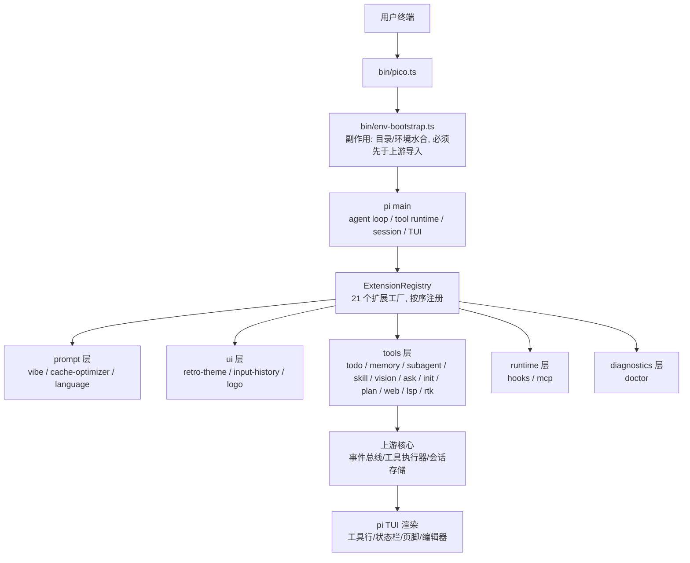
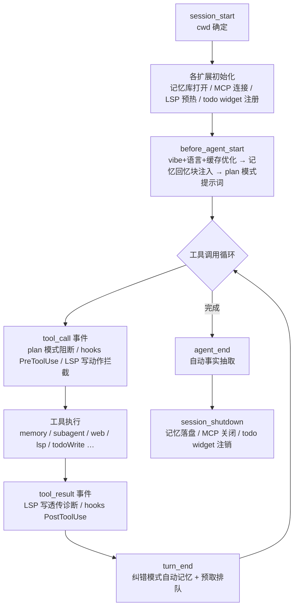
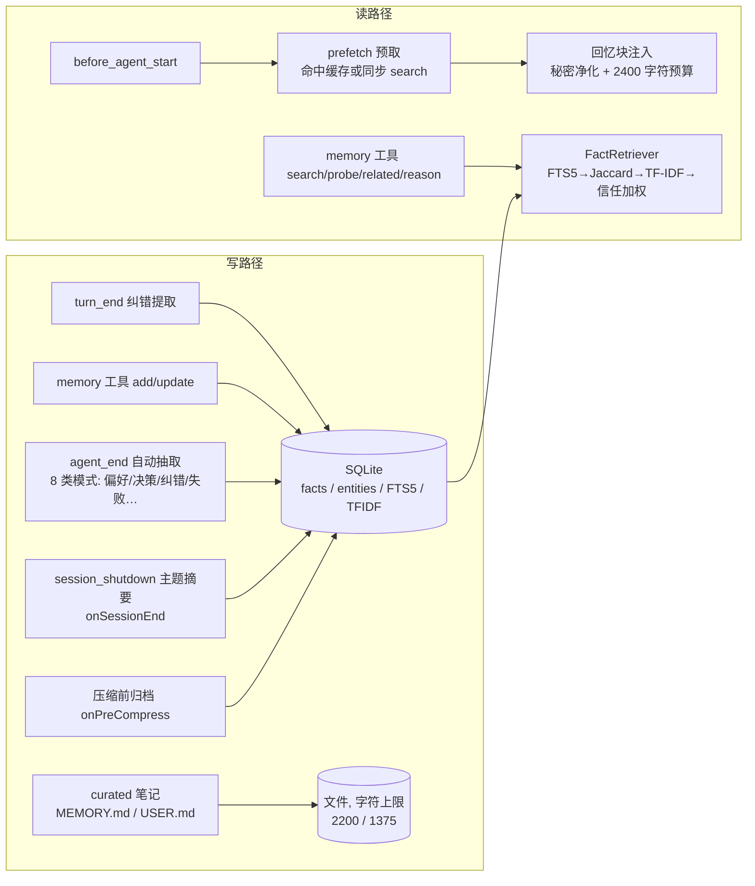

# pico 项目技术总结与复盘（内部归档）

| 项 | 值 |
|---|---|
| 适用范围 | 研发 / 后端 / 运维 / 项目成员 |
| 密级 | 内部，不对外 |
| 版本基线 | 2026-08-02（`fd04fff` / `10fba51` 整改后） |
| 测试基线 | `bun run verify`：385 用例 / 26 文件，tsc --noEmit 0 错误 |
| 用途 | 信息对齐、技术沉淀、流程复盘、新人接手参考 |

---

## 1. 项目定位与架构总览

### 1.1 定位

pico 是基于 `@earendil-works/pi-coding-agent`（下文简称 pi）的 **thin wrapper** 型终端编码代理。上游提供 agent loop、tool runtime、session 管理、TUI；pico 通过扩展工厂注入产品化能力（记忆、子代理、任务清单、计划模式、网络、LSP 等），不 fork 上游核心。

设计原则：

- **不侵入上游**：所有功能通过 `ExtensionFactory` 插件注入，扩展之间通过事件链解耦，禁止扩展间直接 import；
- **薄适配层**：`bin/` + `src/runtime/` 只做参数装配与入口编排；
- **零额外依赖**：测试用 `bun:test` + hand-rolled fakes；无 ESLint/Prettier；`@earendil-works/*` 为唯一上游系。

### 1.2 技术栈与选型

| 项 | 选型 | 理由 |
|---|---|---|
| 运行时 | Bun（非 Node） | 单二进制交付、内建 SQLite / spawn / TUI 生态 |
| 语言 | TypeScript（strict、verbatimModuleSyntax、noUncheckedIndexedAccess） | 上游同栈，类型面干净 |
| 存储 | bun:sqlite（WAL + FTS5） | 零依赖全文检索 + 事务 |
| 语义检索 | TF-IDF 稀疏向量（纯 TS，存 JSON 列） | 替代 hermes 的 HRR numpy 依赖，离线可跑 |
| 测试 | bun:test，`__reset*ForTests()` 钩子 + `PICO_HOME` 临时目录隔离 | 完全离线、无 mock 库 |
| 构建 | `scripts/build.ts` 三阶段（嵌入资源 → `bun build --compile` → package.json） | 产物为 ~102MB 独立二进制 |

### 1.3 整体架构



**入口链**（顺序敏感）：

```
bin/pico.ts
  → bin/env-bootstrap.ts   // 必须最先导入：设置 PI_CODING_AGENT_DIR 等
  → buildRuntimeArgs()     // 自动注入 --prompt-template / --skill（可 -np/-ns 关闭）
  → runSetupCommandIfRequested()  // 包管理命令短路
  → main(args, { extensionFactories })
```

**编译二进制模式**：`prepareEmbeddedRuntime()` 把嵌入资源（prompts/skills/themes/agents）解包到 `$TMPDIR/pico-<rand>`，注册 exit/SIGINT/SIGTERM 清理，并设置 `PI_PACKAGE_DIR` 指向解包目录。

### 1.4 扩展注册顺序与依赖约束

注册顺序：`vibe → cache-optimizer → todo → retro-theme → language → input-history → logo → memory → subagent → skill → vision → ask → init → plan → web → lsp → rtk → hooks → mcp → observability → doctor`（**21 个**）。

`ExtensionRegistry.validate()` 强制：名称唯一、`dependsOn` 只能引用已注册扩展（目前仅 logo → retro-theme）。`before_agent_start` 等事件处理器按注册顺序链式合并返回值，因此 **cache-optimizer 先于 memory 改写 systemPrompt**，动态回忆块不会被静态化到缓存前缀。

---

## 2. 业务链路与任务生命周期

### 2.1 一次任务的完整生命周期



关键时序事实（代码证据）：

- **todoWrite 每次全量替换**：`TodoStore.commit` 以 session id 为 key 全量覆盖，全 completed 自动折叠清空；id 缺失/重复由 store 自动分配并回报模型。
- **记忆写路径异步化**：`WriteQueue`（微任务 FIFO）承载 `syncTurn`/`queuePrefetch` 等后台工作，主 turn 路径不被阻塞；`session_shutdown` 时 `flushPending(2000ms)` 兜底。
- **`/reload` 语义**：pi 先发 `session_shutdown(reason:"reload")` 并调用 `resetExtensionUI()` 清空扩展 widget，再重发 `session_start(reason:"reload")`。扩展侧必须在这两个事件中做对称清理（todo widget 曾因此丢失注册，见 §4.5）。

### 2.2 事件驱动扩展模型

扩展通过 `pi.on(event, handler)` 挂接生命周期：`before_agent_start → session_start → tool_call → tool_result → turn_end → agent_end`。`before_agent_start` 处理器返回 `{ systemPrompt }` 会被链式合并；`tool_call` 返回 `{ block: true, reason }` 可阻断工具。

扩展间通过 `events.ts` 总线解耦（当前仅 `subagent_completed` 一个事件，memory 消费它做委派追踪）。注意：**事件总线不隔离订阅者异常**——单个订阅者抛错会中断后续订阅者并传播给发布方（§4.5 已修复为逐 handler try/catch）。

---

## 3. 核心模块设计与实现

### 3.1 长期记忆子系统（memory）



实现要点：

- **存储**：`facts`（UNIQUE content、trust_score、scope、correction_of、source）+ `entities`/`fact_entities`（实体链接，支撑 probe/related/reason）+ `facts_fts`（FTS5 触发器同步）+ `tfidf_vector`（JSON 稀疏向量）。
- **scope 隔离**：`global` 与 `project:<cwd>` 双 scope；所有读路径（search/probe/related/reason/list）统一经 `scopeFilter` 过滤；`contradict` 在整改前**漏加 scope 过滤**（跨项目事实泄漏，§4.4 已修复）。
- **信任机制**：feedback ±0.05/-0.10 钳制 [0,1]；`correction_of` 惩罚原事实 -0.30 且新事实以 0.70 起步；检索排序乘信任分。
- **时间衰减**：search 主路径（FTS5 SQL 与 substring fallback）与 FactRetriever 混合检索统一按 `updated_at` 乘半衰期衰减因子，默认 180 天（`settings.json` memory.temporalDecayHalfLifeDays 可覆盖，0 关闭）——旧事实降权但永不过滤；`/memory prune` 提供手动清理（trust<0.2 且从未检索）。
- **会话生命周期沉淀**：`onSessionEnd` 写一条主题摘要 fact（source=session-summary，纯指令会话跳过）；`onPreCompress` 在上下文压缩丢弃前归档分支消息并返回 contribution 文本进压缩摘要。
- **纠错检测**：`turn_end` 对用户消息跑 `CORRECTION_PATTERNS`，命中即写入 correction 类事实 + curated 笔记（截断 400 字符）。
- **秘密扫描**：写前 `scanSecrets`（AWS/GitHub/SSH/Stripe/Google key 等模式），命中即拒绝入库；**读出侧**（recall 块）同样净化——含秘密模式的事实以 `[BLOCKED]` 占位进入 system prompt。
- **curated 容量熔断**：MEMORY.md/USER.md 连续 3 次容量错误后返回 `done` 终止性错误（防模型循环重试烧上下文，turn_end 重置计数）。
- **provider 抽象**：`MemoryProvider` 接口 + `ProviderManager` 注册表（`registerMemoryProviderFactory`）；内置 `builtin`（SQLite）与 `holographic`（**demo stub**，JSON 全量读写，prefetch/search 可用，related/reason/contradict 空实现，systemPromptBlock 已标注能力边界）。
- **路径隔离**：`PICO_MEMORY_DB` 只作用于 SQLite；holographic 使用独立 `PICO_HOLOGRAPHIC_MEMORY_PATH`（整改前两后端共用同一 env，存在互覆写风险，§4.4）。

### 3.2 子代理编排（subagent）

```mermaid
flowchart TD
    REQ[subagent 工具调用] --> MODE{模式判定, 必须恰一种}
    MODE --> S[单代理<br/>agent+task]
    MODE --> P[并行<br/>tasks[], ≤8 个, 并发 4]
    MODE --> C[链式<br/>chain[], {previous}/{outputs.x} 占位]
    S --> GATE[项目代理门禁<br/>交互确认 / 非交互需 env 放行]
    P --> WT{isolation=worktree?}
    WT -- 是 --> W[git worktree 隔离<br/>合并前强制提交未提交改动]
    C --> F[fallback 回退链<br/>provider 错误 → fallbackModels]
    F --> ACC[acceptance gate<br/>evidence 命令 + criteria + selfRepair]
    ACC --> PUB[publish subagent_completed<br/>→ memory 委派追踪]
```

实现要点：

- **进程模型**：子代理为独立进程 `pico --mode json -p "Task: …"`；stdout 按行解析 `message_end`/`tool_result_end` JSON 事件流；SIGTERM 5s 后 SIGKILL 升级；stderr 累积进结果（**无界**，见 §5.2）。
- **临时提示词**：agent 的 systemPrompt 写入 `$TMPDIR/pico-subagent-*`（0o600），finally 清理。
- **frontmatter 契约**：`model/tools/thinking/maxExecutionTimeMs/maxTokens/fallbackModels/systemPromptMode/inheritProjectContext/inheritSkills/outputMode/acceptance`。整改前三个开关字段（systemPromptMode/inheritProjectContext/inheritSkills）**解析但从未生效**，已映射到 `--system-prompt`/`--no-context-files`/`--no-skills`（§4.1）。
- **验收门**：`acceptance.evidence` 命令在**主进程**以 `execSync`（60s 超时）执行；`selfRepair` 循环重试；criteria 与 evidence **按下标配对**（设计脆弱点，见 §5.2）。整改前 fallback 模型成功路径绕过验收门（§4.2）。
- **项目代理安全门禁**：`.pico/agents/*.md` 为仓库可控代码（可含任意 evidence 命令）。交互模式弹确认；非交互模式**默认拒绝**，需 `PICO_ALLOW_UNATTENDED_PROJECT_AGENTS=1`（整改前 `hasUI` 为 false 时整个确认被跳过，§4.3）。
- **worktree 模式**：并行任务各自 `git worktree add --detach` + 命名分支；合并前先 `git add -A && commit`（注入 `pico-subagent` 身份），否则未提交改动随 worktree 删除而丢失（§4.4）。

### 3.3 会话任务清单（todo）

- 进程内 `Map<sessionKey, Todo[]>`，**不落盘**（有意设计：跨会话不恢复，逼模型重新排优先级）。
- `todoWrite` 全量替换语义；`multipleInProgress`/`duplicateIds` 不变量以 warning 形式回报模型。
- widget 为 `setWidget` 组件：可见窗口锚定首个非 completed 任务，F7 切换，`openContent` 集合区分"真新任务"与"id 重写"（防止模型换 id 重写同批任务时面板反复弹出）。

### 3.4 计划模式（plan）


要点：进程级单开关（有意为之，一个进程一个 plan 态）；非交互模式需 `PICO_ALLOW_UNATTENDED_PLAN_APPROVAL=1` 才能自动批准；session 切换/分叉时重置（整改后，防止旧会话 plan 文件串台）。

### 3.5 Web 搜索与抓取（web）

- **webSearch**：默认 Exa MCP 端点（JSON-RPC 2.0，兼容 SSE 分帧）；有 `TAVILY_API_KEY` 时 hybrid 并行合并（URL 去重）；`PICO_SEARCH_PROVIDER=exa|tavily` 强制单源，**强制但缺 key/非法值 → 显式报错**（整改前静默降级，§4.3）。单请求 15s 超时（headers+body 同一作用域）。
- **webFetch**：http→https 升级、**手动重定向**（每跳复检私网）、私网防护（IPv4 段 / IPv6 ULA / mapped-IPv6 / 整数与十六进制 IP 写法）、1MiB body 上限、8KiB 输出截断（UTF-8 边界回退）、15min/50 条 LRU、同 URL 并发合并（single-flight）。4xx/5xx **不缓存**且 `isError=true`（整改后）。
- 已知残留：防护仅字符串级 hostname 判定，`*.nip.io` 类 DNS 重绑定域名可绕过（见 §5.2）。

### 3.6 LSP 代码智能（lsp）

- 统一 `lsp` 工具 + `action` 路由：hover/definition/references/diagnostics/symbols/code_actions/capabilities/status 只读；rename/rename_file/request 及 code_actions apply=true 由 `isLspWriteOrHighRiskInput` **双层阻断**（execute 入口 + tool_call hook）；`reload`（重启服务器、不写文件）2026-08 起放行。
- 懒启动 + session_start 预热；`ensureServer` 有 initializing 在途复用（整改后，消除并发双 spawn 孤儿进程）；初始化失败统一 `client.shutdown()` 回收进程（整改后）。
- 写透传：edit/write 后 `didSave` + `didChangeWatchedFiles` → 500ms 内联 + 5s 上限的诊断等待（整改前 25.5s 阻塞 turn，§4.5），经 `DiagnosticsLedger` 去重后追加进 tool_result（identity 保留行号，整改后）。
- 诊断管线（2026-08 第六轮）：`publishDiagnostics` 推送缓存 + 版本追踪（`waitForDiagnostics` 只认 ≥ 同步版本的 publish，丢弃 didSave 后到达的旧版本竞态）；服务器声明 `diagnosticProvider`（静态能力或 `client/registerCapability` 动态注册）时优先 `textDocument/diagnostic` 拉取快照，失败回退推送等待。
- 服务器请求应答（2026-08 第六轮）：`workspace/configuration` 从 `ServerConfig.settings` 按 section 服务 + 初始化后 `workspace/didChangeConfiguration` 推送（此前 settings 解析后从未送达，属死配置）；`client/registerCapability`/`unregisterCapability` 动态追踪；`workspace/applyEdit` 仍应答 `{applied:false}` 拒绝应用。
- `formatOnWrite` 受 `PICO_ALLOW_LSP_FORMAT_ON_WRITE` 双重管控（policy + 执行点）。
- 已知残留：慢服务器多文件并发诊断仍无合并聚合（单文件窗口 + 缓存回退）；prewarm 已改用 `guessLanguageId` 规范映射（整改后）。

### 3.7 安全策略（policy）

五个安全开关，统一解析链：**env（1/true/yes/on）→ settings.json `safety` 字段 → 默认拒绝**：

| 开关 | env | 作用点 |
|---|---|---|
| 计划自动批准 | `PICO_ALLOW_UNATTENDED_PLAN_APPROVAL` | plan ExitPlanMode |
| LSP 写后格式化 | `PICO_ALLOW_LSP_FORMAT_ON_WRITE` | lsp 写透传 |
| 项目级 hooks | `PICO_ENABLE_PROJECT_HOOKS` | hooks 配置加载 |
| 项目级 MCP | `PICO_ENABLE_PROJECT_MCP` | mcp 配置加载 |
| 项目级 LSP | `PICO_ENABLE_PROJECT_LSP` | lsp 配置加载（`.pico/lsp.json`，2026-08 起 opt-in） |
| 非交互项目代理（env-only） | `PICO_ALLOW_UNATTENDED_PROJECT_AGENTS` | subagent 门禁 |

### 3.8 构建与发布

三阶段：**① 嵌入资源生成**（`src/generated/embedded-assets.ts`，prompts/skills/themes/agents 打包进二进制）→ **② `bun build --compile`**（~102MB 单文件）→ **③ 生成 build/package.json**（`piConfig.name="pico"`，使上游读 `PICO_CODING_AGENT_DIR`）。产物旁需要 prompts/agents 目录（编译模式由嵌入式资源提取兜底，见 §6.2）。

---

## 4. 开发过程难点、坑点与解决方案

以下为审查与整改阶段确认的真实问题（均已在 `fd04fff` / `10fba51` 修复并附回归测试）。

### 4.1 运行时与 IO 语义

**坑 1：Bun 管道 stdin 写入不自动 flush —— MCP 全链路不可用（高）**
- 现象：MCP 所有 JSON-RPC 请求 30s 超时；`client.ts` 写入后注释写着 "Flush and wait for response" 但无任何 flush 调用。
- 根因：`Bun.spawn` 的 `stdin: "pipe"` 是 FileSink，写入进缓冲。实测：不 flush 写入 1s 未达子进程，`end()` 后才送达。MCP 服务端是长驻进程，缓冲永不自然排空。
- 方案：每次写入后显式 `flush()`；`McpServerHandle.stdin` 类型补 `flush?`。配套真实子进程 echo server 集成测试（`tests/mcp.test.ts`），防止回归。

**坑 2：fetch 超时作用域不覆盖 body 下载 —— webFetch 可无限挂起（高）**
- 现象：`timeout.cleanup()` 在重定向循环的 `finally` 中执行，`readResponseText` 在其后裸露执行；服务器返回响应头后 body 停滞时工具永久挂起。
- 方案：body 读取纳入同一 try/finally 作用域；外部 signal 的 abort 转发保持到 body 读完。回归测试用"永不结束的 body + 同步 abort"验证。

**坑 3：agent frontmatter 三个声明字段从未生效**
- 现象：`systemPromptMode`/`inheritProjectContext`/`inheritSkills` 被解析进 AgentConfig 并在工具描述中宣传，但 `buildAgentProcessArgs` 从不消费。
- 方案：映射到 pi 已有 CLI：`--system-prompt`（替换）/`--no-context-files`/`--no-skills`。

**坑 4：hooks 大输出必然超时被杀**
- 现象：`runHook` 先 `await child.exited` 再读流；hook 输出超过管道缓冲（~64KB）时子进程阻塞写、永不退出，必被 30s 超时 SIGKILL。此前反向修复（SIGKILL 后流不 EOF 挂起）造成的取舍。
- 方案：读流与退出等待**并发**启动，正常退出后 await 读流；超时路径不等待流（悬空 reader 可接受）。

### 4.2 并发与生命周期

**坑 5：fallback 模型成功路径绕过 acceptance gate（中）**
- 现象：`runWithFallbackModels` 回退成功后直接 return，`onSuccessOrNoFallback`（验收门）只在主路径调用；主模型 provider 错误触发回退时，回退输出未经验证即交付。
- 方案：回退成功同样调用 `onSuccessOrNoFallback(fallbackAgent, result)`。回归测试断言 gate 被调用且收到 fallback agent。

**坑 6：LSP 并发双 spawn 与初始化失败进程泄漏（中）**
- 现象：`ensureServer` 只检查 `client.ready` 不检查 `initializing` 在途；session_start 预热与首个 lsp 调用并发时双进程，先 spawn 者成孤儿。初始化失败路径只 delete 记录不 shutdown，已 spawn 进程常驻。
- 方案：ready 循环中复用并 await `managed.initializing`；失败路径 `client.shutdown().catch(noop)`。

### 4.3 安全与权限

**坑 7：非交互模式跳过项目代理确认（中）**
- 现象：确认条件 `confirmProjectAgents && ctx.hasUI`——非交互（CI/--print）下 `hasUI=false`，仓库可控的项目代理（含任意 evidence 命令）自动执行。
- 方案：非交互模式默认拒绝，`PICO_ALLOW_UNATTENDED_PROJECT_AGENTS=1` 显式放行；与 plan 模式开关对齐。工具描述同步说明。

**坑 8：settings.json 0644 明文密钥（中）**
- 现象：`writeSettings` 未指定 mode（umask 022 → 0644），而 `env` stanza 存 TAVILY_API_KEY 等；对照 input-history 已用 0o600。
- 方案：settings.ts / language.ts 写入统一 `mode: 0o600`。

**坑 9：webSearch provider 强制选择被静默忽略（中）**
- 现象：`PICO_SEARCH_PROVIDER=tavily` 但无 key 时静默走 Exa；非法值静默走 hybrid。setup 向导会写入该配置，用户配置与实际来源不一致且无提示。
- 方案：强制 tavily 缺 key、未知 provider 值 → 显式抛错，不发请求。

**坑 10：私网防护误伤与绕过并存**
- 现象：`isPrivateHost` 对 fc/fd 前缀做**字符串**判定，fcc.gov 等公共域名被误拒；同时整数 IP（2130706433）、十六进制（0x7f000001）写法可绕过（`parts.length !== 4` 直接放行）。
- 方案：fc/fd/fe80 规则仅对含 `:` 的 IPv6 字面量生效；新增 `parseNumericIpv4` 归一化整数/十六进制后再判定。

### 4.4 数据一致性与边界

**坑 11：PICO_MEMORY_DB 双后端共用导致数据互覆写（高）**
- 现象：SQLite 库路径与 holographic JSON 路径共用同一 env；JSON 后端 `_save()` 会把整个 SQLite 库覆写为 JSON，`_load()` 对非 JSON 静默置空。
- 方案：holographic 改用独立 `PICO_HOLOGRAPHIC_MEMORY_PATH`；`paths.test.ts` 增加互不覆盖断言。

**坑 12：contradict 无 scope 过滤，跨项目事实泄漏（中）**
- 现象：`contradict()` SQL 无 scope 条件，工具层只传 category/limit；而 search/probe/list 均有 scope 隔离——其他项目的 project 事实全文出现在当前项目输出中。
- 方案：`contradict` 增加与 search 一致的 `scopeFilter`；provider 接口签名扩展 scope/cwd；回归测试验证 `/proj/a` 与 `/proj/b` 互不可见。

**坑 13：worktree 未提交改动随清理丢失（中）**
- 现象：合并判定基于提交历史（`git diff HEAD..branch`）；子代理默认不提交 → diff 空 → "no changes to merge" → cleanup 删除 worktree，改动静默丢失。
- 方案：合并前 `status --porcelain` 检测 + `add -A && commit`（注入固定 git 身份）；提交失败时在合并备注中明示"改动可能丢失"。

**坑 14：实体别名 LIKE 通配符误匹配（低）**
- 现象：`(',' || aliases || ',') LIKE ?` 未转义 `%`/`_`；标识符实体（`foo_bar`）会被单字符差异的查询误命中。
- 方案：`escapeLike` + `ESCAPE '\'` 子句。

### 4.5 UI 一致性

**坑 15：todo widget 在 /reload 后永久消失（中）**
- 现象：pi `resetExtensionUI()` 清空扩展 widget 但模块级 `registered` 标志不清零；`session_start(reload)` 重发后 `ensureTodoWidget` 直接 return，面板本会话不再渲染。
- 方案：`session_shutdown`/`session_before_switch`/`session_before_fork` 统一 `unregisterTodoWidget`（清 registered + 状态），下次 session_start 重建。回归测试模拟 reload 时序。

**坑 16：单行超长内容截断后无展开入口（中）**
- 现象：`hiddenLines` 只统计超行数；窗口内单行 >180 字符被 `collapseLine` 静默截断且 `hiddenLines===0`，不显示 expand 提示，内容不可见。
- 方案：`previewText` 增加 `truncatedLine` 标志，结果渲染在行内截断时也附展开提示（expanded 分支本就输出全文）。

**坑 17：chain 渲染将 gate_failed 显示为成功（中）**
- 现象：chain 步骤统计用 `r.exitCode === 0`，而 gate 失败只改 `stopReason` 不改 exitCode → 验收失败显示 ✓。
- 方案：统一改用 `isFailedResult(r)`；新增渲染回归测试。

**坑 18：诊断等待固定 25.5s 阻塞 turn（低）**
- 现象：写透传在 `tool_result` 处理器内最多等待 25.5s（500ms + 25s 轮询窗口）。
- 方案：上限收敛至 5s；ledger 清理路径打通（诊断清空时也调 reduce）。

### 4.6 第二轮整改（2026-08-03 全项目只读审查，3 高 / 15 中 / 21 低，全部附回归测试）

**坑 19：LSP 写透传原地改事件而非返回（高）**
- 现象：`tool_result` handler 内 `event.content = [...]` 追加格式/诊断文本，但上游 `emitToolResult` 先浅拷贝事件、只认 handler **返回值**（runner.js `modified` 仅在返回值携带字段时置位）——写后诊断/格式化提示对 agent 完全不可见，且无任何报错。
- 方案：handler 收集追加项后以返回值返回完整 `{ content: [...] }`；同时入口检查 `event.isError`，失败写不再触发 formatOnWrite（避免把失败写替换成"格式化旧内容"的写盘）。回归：lsp.test.ts 契约用例 + 假服务器集成测试。

**坑 20：MCP reconnect 后全部工具永久失效（高）**
- 现象：execute 闭包捕获首次注册的 handle，reconnect（cwd 变化/session 重启）后 `registeredTools` 阻止再注册，新 handle ≠ 旧 handle 恒成立，所有 `mcp__` 工具抛 "no longer active"。
- 方案：per-tool 可变 holder（`toolRefHolders`），execute 每次读 holder 当前 ref；connect 代际计数防竞态。回归：mcp.test.ts reconnect + 竞态用例。

**坑 21：setup 写配置 0644 且非原子（高）**
- 现象：向导 `writeJson` 无 mode（0644），settings.json env stanza / models.json apiKey 世界可读；直接写盘崩溃留截断文件。
- 方案：tmp+rename 原子写 + `{ mode: 0o600 }`。回归：setup.test.ts 权限断言。

**坑 22：SIGKILL 升级依赖 `proc.killed`（中）**
- 现象：subagent process.ts 与 LSP client.ts 的 "5s/2s 后 SIGKILL" 升级均以 `if (!proc.killed)` 为门，而 Node 在首次 `kill()` 调用后立即置 `killed=true`——升级永不执行：忽略 SIGTERM 的子代理令工具调用无限挂起，LSP 僵死服务器常驻。
- 方案：定时器触发时无条件 `kill("SIGKILL")`（close/exit 会清定时器，触发即证明进程仍存活）；LSP shutdown 请求同时限 2s。回归：subagent.test.ts kills 断言。

**坑 23：waitForDiagnostics 缓存短路丢新诊断（中）**
- 现象：缓存已有非空诊断时立即返回，同一文件第二次写后服务端 publish 的新诊断无人读取。
- 方案：waitForDiagnostics 不再读缓存（只等 didSave 后新 publish），didSave 时使缓存失效。回归：lsp.test.ts 假服务器两次 didSave 分别拿到 error-1/error-2。

**坑 24：ensureNamedServer 初始化失败进程泄漏（中）**
- 现象：ensureServer 失败路径显式 `client.shutdown()` reap，ensureNamedServer 只删状态条目——spawn 成功但握手失败的服务器进程泄漏。
- 方案：两路径对齐，catch 补 shutdown。回归：lsp.test.ts 启动即退服务器用例。

**坑 25：contradict scope 修复不完整（中）**
- 现象：上轮坑 12 只修了 retriever 层；builtin provider 的 `contradict()` 签名仍丢弃 scope/cwd，`memory(action=contradict, scope=project)` 静默退化为全局-only 结果。
- 方案：provider 接口与 builtin 透传 scope/cwd/threshold；`/memory contradict` 支持 `--scope`。回归：memory.test.ts 项目/全局隔离用例。

**坑 26：hooks 占位符吞大写环境变量（中）**
- 现象：`$[A-Z][A-Z0-9_]*` 未命中 vars 的 token 一律替换为空串——`rm -rf $HOME/tmp` 变成 `rm -rf /tmp`。
- 方案：未知 token 原样保留交 shell 展开（$FILE 等已知键仍替换）。回归：hooks.test.ts 断言保留。

**坑 27：hooks 超时只杀直接子进程（中）**
- 现象：SIGKILL 只发给 sh，孙进程（npm/node 子进程）成孤儿并持有管道写端，reader 永不 EOF。
- 方案：`Bun.spawn` 加 `detached: true`（独立进程组），超时 `process.kill(-pid, "SIGKILL")` 杀整组。回归：hooks.test.ts 孙进程存活检查。

**坑 28：vision image_url 无私网防护（中）**
- 现象：visionAnalyze 的 URL 拉取无 SSRF 防护（webFetch 有完整防护），本地/云元数据地址可被拉取并经视觉模型间接外泄。
- 方案：复用 web/fetch.ts 的 `isPrivateHost`（导出）。回归：vision.test.ts 拒绝 127.0.0.1/localhost/169.254.169.254。

**坑 29：worktree 分支名拼接 agent 名（中）**
- 现象：agent 名（LLM 输入）直接进 `execSync` 双引号串且创建前不校验存在性——含 shell 元字符的名字可注入命令。
- 方案：`sanitizeAgentNameForWorktree` 白名单清洗。回归：subagent.test.ts 清洗用例。

**坑 30：MCP connect 无代际保护（中）**
- 现象：两次 session_start 落在首次 connect 异步窗口内时，旧代循环仍 push 旧 handle，旧进程无人关闭。
- 方案：connectGeneration 计数，过期代关闭自身 handle 后 return。回归：mcp.test.ts 竞态用例（deferred initialize）。

**坑 31：curated 条目破坏定界符 + add 绕过 drift（中）**
- 现象：note_add 不经 clampEntry，含字面 `\n§\n` 的条目损坏文件格式并使 drift 守卫永久拒绝后续写入；`add()` 以 skipDrift 重载会静默折叠用户手写格式。
- 方案：add 统一 clampEntry + 与 replace/remove 相同的 drift 检查。回归：memory.test.ts clamp/drift 用例。

**坑 32：工具返回值 isError 是死字段（中）**
- 现象：agent-loop 只在 execute() **抛异常**时置 isError（`executePreparedToolCall` 恒定 `{ result, isError: false }`），vision/web/mcp/ask/subagent/plan/lsp 以 `isError: true` 返回的错误渲染为成功样式。
- 方案：错误路径统一改 `throw`（上游 catch 生成 error result，模型文本不变，TUI/导出正确标红）。回归：ask/plan/lsp/mcp/subagent/vision/web 测试全部改 rejects 断言。

**坑 33：vision 多图部分失败丢弃成功结果（低）**
- 现象：input 事件多图共用一个 try，任一图失败即丢全部已成功分析。
- 方案：逐图 try/catch，失败单独成条目。回归：vision.test.ts（input handler）。

**坑 34：LSP 低危批量（低）**
- diagnostics 缓存 didClose 不清理（陈旧工作区诊断）；applyWorkspaceEdit create/delete 语义与 LSP 规范相反（死代码，防未来调用）；Dockerfile 无扩展名无法路由（extOf 返回裸文件名）；`indent_size = tab` → NaN → tabSize:null；rootMarkers glob 永不命中（新增通配扫描）；安装后重试 COMMAND_NOT_FOUND 裸异常；ledger 相对/绝对路径键不一致（统一 resolve）；无订阅的 EventEmitter 收到 "error" 通知抛异常（删除）；已退出服务器 stdin EPIPE 无监听（挂空监听 + exit 置 null）。

**坑 35：其余低危批量（低）**
- retrieval.ts 实体别名 LIKE 未转义（store.ts 已修，retriever 遗漏）；`/memory related/reason` 不支持 `--scope`；holographic 后端在 `/memory status` 标注 demo；rtk SKIP 前缀漏长驻命令变体（tail --follow 等）；PICO_HOME 相对路径/~ 未规范化；cache-optimizer sessionManager 访问无保护；input-history 整文件读改写并发丢条目（改追加语义）；setup 孤立 ESC 无超时窗口、splitArgs 无引号处理；PreSessionEnd 串行等待（并行 + 30s 总预算）；embedded-runtime 信号监听抢先 exit（删除，交宿主）。

---

### 4.7 第四轮整改（2026-08-05 全项目只读深度审查，4 高 / 29 中 / 37 低，全部附回归测试）

**坑 36：LSP 写透传空诊断 5.5s 阻塞（高）**
- 现象：`waitForDiagnostics` 收到快速发布的 `[]` 与超时 null 走同一分支，无条件进入 5s 二次等待；该 await 在 tool_result handler 内联执行，整轮 agent 被卡。
- 方案：提取 `waitForFreshDiagnostics`——仅当内联窗口超时（null）才进入 deferred wait；`[]` 视为服务器已响应。回归：lsp.test.ts 空发布短路用例（calls === 1）。

**坑 37：worktree 冲突检测检查错误输出流（高）**
- 现象：git 的 CONFLICT 通知走 stdout，`/CONFLICT/.test(err.stderr)` 几乎永不命中 → `git merge --abort` 不执行，主树残留 MERGE_HEAD 与冲突标记；且合并失败分支在 cleanup 被 `git branch -D` 删除，任务产出彻底丢失。
- 方案：stdout+stderr 双查 + `LC_ALL=C` 固定输出语言；失败合并置 `keepBranch`，cleanup 跳过分支删除。回归：真实 git 仓库冲突/保留用例（tests/subagent.test.ts）。

**坑 38：子代理信号死亡伪装成功（高）**
- 现象：close(code=null) 映射为 exitCode 0，被 OOM/段错误杀死的子代理输出当作成功交付。
- 方案：`code ?? 1`。回归：close(null) 非 abort 路径断言 exitCode 1。

**坑 39：vision image_url 重定向绕过私网防护 + 无超时（高）**
- 现象：初始 URL 检查后 `redirect: "follow"` 默认跟随，302 到内网/元数据地址的内容经视觉模型外泄；fetch 与 body 读取无 deadline。
- 方案：`redirect: "manual"` 逐跳复验 isPrivateHost（限 5 跳）+ 复用 web 的 withTimeoutSignal（15s，覆盖 body）。回归：vision.test.ts 重定向拒绝/跟随/上限/预中止用例。

**坑 40：memory scope="project" 无 cwd 落裸 scope（中）**
- 现象：写侧降级为裸 `project`，所有带 cwd 读路径不可见——静默数据丢失。
- 方案：无 cwd 时显式拒绝。回归：store.add 无 cwd project scope rejects。

**坑 41：curated replace() 绕过 clampEntry（中）**
- 现象：replace 只 trim，含 `\n§\n`/换行条目破坏文件格式并触发 drift 永久拒写（add 已修而 replace 漏修）。
- 方案：replace 复用 clampEntry。回归：replace 钳制 + 后续写入不被 drift 卡住。

**坑 42：MCP 工具 isError 返回字段残留（中）**
- 现象：execute 返回对象带 `isError: result.isError ?? false`——上游只认 throw，服务器报错渲染为成功（坑 32 唯一漏网点）。
- 方案：`result.isError === true` 时 throw。回归：mock callTool isError 拒绝用例。

**坑 43：MCP connect 串行 + 30s 硬超时 + 失败不重试（中）**
- 现象：逐 server await，单个坏 server N×30s 阻塞启动；connectedCwd 置位后同 cwd 内不重试。
- 方案：`Promise.allSettled` 并行；initialize 单独 60s 超时（npx 冷启动）；failedServerIds 在后续 session_start 重试；注册中途失败回滚 activeTools/toolRefHolders。
- 回归：重试/回滚/isError/关闭后 fail-fast 用例。

**坑 44：MCP 关闭只杀直接子进程（中）**
- 现象：npx 孙进程成孤儿并持有 stdout 管道。
- 方案：spawn `detached: true`，close 走进程组 SIGTERM→2s SIGKILL；stdout buffer 1MiB 上限。

**坑 45：MCP 配置零校验静默吞错（中）**
- 方案：逐 server 校验 command/args/env，非法项 warnOnce 带名跳过。回归：坏配置不影响好配置加载。

**坑 46：events 总线订阅跨会话累积（中）**
- 现象：/reload 清缓存重跑全部扩展 factory（resource-loader.reload 已核实），subscribeExtensionEvent 退订函数被丢弃，handler 翻倍。
- 方案：新增 `subscribeSessionExtensionEvent` + `clearSessionExtensionSubscriptions`，memory/todo 改用并在 `session_shutdown(reason:"reload")` 清理。回归：events.test.ts 三代订阅只留一代。

**坑 47：hooks/acceptance evidence execSync 阻塞主循环（中）**
- 现象：60s/条同步阻塞，UI/其他工具/MCP 在途请求全冻结，AbortSignal 无法中断。
- 方案：gates.ts 改异步 spawn（detached 进程组 + 超时/中止清理）；`expect:"exit 1"` 精确匹配 status===1，未知 expect 值显式报配置错误。回归：异步/中止/精确判定用例。

**坑 48：subagent stdout 按 chunk 独立解码（中低）**
- 现象：多字节 UTF-8 跨 chunk 边界变 U+FFFD，事件内容损坏。
- 方案：TextDecoder 流式解码（构造不带 stream 选项，decode 时传 {stream:true}），close 时 flush。

**坑 49：webFetch charset 硬编码 / 二进制无防护 / 3xx 无 Location 误缓存 / single-flight 丢 signal（中）**
- 方案：Content-Type charset 解析（gbk/shift_jis 等，Bun 运行时支持）→ 对应 TextDecoder；非文本类型返回 `Binary content (…), skipped`；缓存条件收紧为 2xx，3xx 无 Location 抛错；single-flight 等待者自己的 signal 生效。回归：web.test.ts 5 个新用例。

**坑 50：webSearch SSE 等 EOF 才解析（中）**
- 方案：增量读取，首个可解析 data 事件即返回；parseExaResponse 兼容 `data:` 无空格与多行拼接。回归：keep-alive 流 + 无空格/multiline 解析用例。

**坑 51：rtk 无运行期可用性检测（中）**
- 方案：spawnHook 前按命令名缓存探测 PATH；缺失时不改写并在 session_start 提示。回归：PATH 探测与缓存用例。
- 同批：长驻命令按 head 扩展（kubectl logs -f / docker compose up / tsc --watch / cargo watch / eslint --watch），`-f` 仅在有 follow 语义处判定。

**坑 52：hybrid URL 去重不归一 / 单源失败静默（中低）**
- 方案：`new URL` 归一化（去 fragment/默认端口/尾斜杠）做 key；单源失败 console.warn。

**坑 53：settings.json 损坏后全量覆写（中）**
- 现象：readSettings catch 返回 {}，/language 读改写把损坏文件替换为仅 language 对象，API keys/safety 全丢。
- 方案：settings.ts 增加 `isSettingsDamaged()`（文件存在但解析失败）；language.ts 重构为复用共享助手并拒绝写损坏文件。回归：损坏文件 + 拒绝写入。

**坑 54：plan 状态先置/原子写/ExitPlanMode 无门（中低）**
- 方案：EnterPlanMode 先建文件成功再置状态（失败不复位锁死）；SubmitPlan tmp+rename 原子写；ExitPlanMode 非激活直接报错。回归：只读目录进入失败/非激活 ExitPlanMode 用例。

**坑 55：todo 面板 plan 退出不恢复（中）**
- 方案：widget 增加 restoreTodoWidget；plan_mode_changed(false) 恢复面板。回归：collapse/restore 状态机用例。

**坑 56：/init 审计无代码级确认门（中）**
- 方案：AGENTS.md 已存在时交互模式先 `ui.confirm` 再注入审计提示词。

**坑 57：崩溃 marker 并发实例误报/互删（中）**
- 方案：isStaleMarker 先做 pid 存活探测（kill 0），存活即并发实例不提示；quit 只清 pid 匹配自己的 marker。回归：guidance 测试。

**坑 58：tool-render ANSI 终端注入（中）**
- 现象：MCP/文件/记忆内容含 ESC 序列直达终端（OSC 52 覆写剪贴板、伪造 UI）。
- 方案：ui/rendering.ts 新增 `sanitizeTerminalText`（OSC/CSI/C0 剥离），tool-render 调用/结果渲染前统一消毒。回归：渲染无 ESC 残留用例。

**坑 59：logo 每帧渲染同步磁盘 IO（中）**
- 方案：会话信息 5s TTL 缓存（session_start 失效）；label 只读文件头 4KB（openSync+readSync）。回归：logo 测试通过。

**坑 60：前端低危批量（低）**
- truncateWithEllipsis 改码点截断（不劈代理对）；footer git 超时结果不缓存（下次渲染重试）；input-history trim 加 mkdir 锁串行化 + 30s 残留恢复；ActivityTracker 在 session_shutdown 复位。

**坑 61：入口/配置低危批量（低）**
- bin/pico.ts console.clear 仅限交互 TTY 非帮助/非 --mode 场景；setup 安装命令 `set -o pipefail`（curl|sh 退出码遮蔽）+ 安装失败/跳过不再落盘 enabled=true；--reset 清理 lsp/hooks/mcp 文件；未知 section 显式报错；/doctor 非交互输出到 stdout；models.json 推理 compat 扫描（JSON 解析，provider/模型级 compat 均可识别）；env-bootstrap 与 paths.ts 的 PICO_HOME 归一化统一（~ 展开 + resolve）；memory ftsCandidates 失败告警。

**坑 62：其余低危（低）**
- 子代理 frontmatter 逐文件 try/catch（坏 YAML 不再拖垮整个工具）；subagent.json overrides 复用 >0 数值校验；file-only 大输出 tmp 目录返回清理函数（orchestrator finally 调用）；cache-optimizer DISABLE 补 PI_ 别名、prompt_cache_key 仅注入 openai-completions；todo schema 长度约束；/language 校验（64 字符、禁换行）；ask 重复 question 拒绝；LSP 负值 line/character 校验、execute signal 透传、applyEdit 应答 `{applied:false}`、file:// URI 编解码、idle 回收等待在途关闭、formatOnWrite mtime 新鲜度校验、installServer 异步化（进程组超时）、typescript-native 探针按 (command,cwd) 缓存。

## 5. 当前版本现状与已知局限

### 5.1 现状

- 功能面完整：20 扩展、497 用例全绿、`bun run verify`（tsc + 全量测试）通过；
- 第三轮 UX 整改（2026-08-05，依据 `docs/ux-walkthrough-review.md`）：离线 `/help` 与无模型/推理 400/崩溃恢复引导（guidance 扩展）、config.yml 双轨冲突检测、`<inline:N>` 启动噪音消除（InlineExtension hidden）、LSP 缺失命令警告去重与可执行建议、生成阶段动态反馈、计划模式挂起 todo 面板、CLI 品牌统一、MCP 状态可读化、logo 首启文案与真实会话、`/memory status` 类别分布、rtk 启用提示；全部附回归测试；
- 安全默认值：项目 hooks/MCP 默认关、非交互项目代理默认拒、LSP 写动作默认阻断、计划自动批准默认关；
- 工具错误语义对齐上游：失败一律 throw（agent loop 仅以异常判定 isError）；第四轮整改（2026-08-05，依据深度技术分析报告）修复 4 高 / 29 中 / 37 低，覆盖 LSP 写透传短路、worktree 冲突与分支保留、子代理退出码、vision SSRF、MCP 并行连接与进程组、事件订阅生命周期、异步化 gate、ANSI 终端注入等；

### 5.2 已知局限（客观记录）

| # | 局限 | 影响 | 状态 |
|---|---|---|---|
| L1 | **holographic provider 为 demo stub**：JSON 全量读写、related/reason/contradict 空实现、无并发写保护 | 选它做后端等于降级 | 已标注能力边界；prefetch 已接通 substring 检索 |
| L2 | 记忆检索无真语义：TF-IDF + 固定同义词表，跨语言/深度改写召回有限 | 召回率上限 | 待评估 embedding 方案 |
| L3 | `acceptance.criteria` 与 `evidence` **按下标隐式配对** | 配置错位时门禁误判 | 待改命名配对 |
| L4 | pi 无工具注销 API：MCP 工具名进程内不可刷新 | 工具列表无法刷新（已用 holder 修复闭包失效） | 受上游约束 |
| L5 | ~~LSP 诊断等待为轮询窗口（500ms/5s），非事件驱动~~（已改：2026-08 第六轮起事件驱动 + 版本追踪 + 拉取式诊断，见 §3.6） | — | 已修 |
| L6 | 子代理 stderr 无界累积；`sessionMessages` 会话内无界增长 | 长会话内存 | 待加截断/上限 |
| L7 | 私网防护仅 hostname 字符串级，`*.nip.io`/DNS rebinding 可绕过 | SSRF 边界缺口（本地代理影响有限） | 待 DNS 解析复检 |
| L8 | worktree 合并按任务序串行，冲突仅报错不自动处理 | 冲突时需人工 | 已知 |
| L12 | 记忆库无归档/衰减策略（facts 无限增长，contradict 仅分析最近 500 条） | 库膨胀 | 已落地时间衰减（默认 180 天降权）+ `/memory prune` 手动清理；自动合并/遗忘仍待迭代 |
| L13 | ~~LSP 写透传空诊断短路的残余~~（已改：诊断等待事件驱动 + 超时回退最近缓存 + didSave 后旧版本 publish 丢弃；慢服务器不再误报"无诊断"，见 §3.6） | — | 已修 |
| L14 | ~~子代理超时只杀直接子进程~~（已核实：subagent 自 2.4.1 起即用 `detached` 进程组 + SIGTERM→SIGKILL 击杀；L5 把 worktree git 命令也改为异步进程组） | — | 已修 |
| L15 | **todo 重复 id 重分配的新 id 映射仅在 details**，模型可见性取决于 provider 序列化 | 重复 id 时 id 不稳定 | 待把映射写入 content |
| L16 | **plan 同批 ExitPlanMode+write 时序矛盾**：并行工具执行下 tool_call 阻断先于批准生效 | 批准后同批写仍被拒，需重发 | 受上游执行序约束，待同批放行 |
| L17 | **cache-optimizer 对 responses/codex 未知字段行为**（已改为不注入，记录原始风险） | 严格网关 400 风险已消除 | 已修 |
| L18 | **agent_end 全量重抽取**可能重复写入 | 记忆重复 | 已缓解：`seenMessageTexts` 指纹去重 + UNIQUE(scope, content) 幂等；`onPreCompress` 复用同一抽取管线 |

### 5.3 待优化项与迭代规划（建议排序）

1. ~~事件驱动 LSP 诊断~~（L5/L13 已修：第六轮实现版本追踪 + 拉取式诊断 + 事件驱动等待）；慢服务器多文件并发诊断合并仍待迭代；
2. ~~记忆归档与衰减~~（L12 已落地：时间衰减 + `/memory prune`；自动合并/遗忘仍可迭代）；
3. **acceptance 命名配对**（L3）——避免隐式下标契约；
4. **子代理输出上限**（L6）——stderr 截断、sessionMessages 封顶；
6. 评估 embedding 检索（L2）与 DNS 级 SSRF 防护（L7）为远期项。

---

## 6. 部署、运行与运维要点

### 6.1 环境依赖

- **Bun**（当前验证版本 v1.3.14；`bun.lock` 锁定依赖）；
- Linux / macOS（未验证 Windows 原生）；
- 无运行时 Node 依赖；离线测试（bun:test 不联网）。

### 6.2 构建与启动

```bash
bun run start      # 源码模式开发
bun run build      # 三阶段构建，产物 build/pico（~102MB 独立二进制）
bun run verify     # tsc --noEmit + 全量测试
bun test tests/<feature>.test.ts  # 单文件测试
```

编译模式注意：

- 二进制内置 prompts/skills/themes/agents 资源，启动时解包到 `$TMPDIR/pico-<rand>`（exit/SIGINT/SIGTERM 清理）；`PI_PACKAGE_DIR` 指向解包目录；
- `build/package.json` 设 `piConfig.name="pico"`，上游据此读 `PICO_CODING_AGENT_DIR`；
- 版本检查默认禁用（`PI_SKIP_VERSION_CHECK=1`），避免 wrapper 版本与上游版本误报更新。

### 6.3 关键环境变量

| 变量 | 用途 | 默认 |
|---|---|---|
| `PICO_HOME` | 数据根目录重定位 | `~/.pico` |
| `PICO_MEMORY_DB` | SQLite 记忆库路径 | `$PICO_HOME/memory.db` |
| `PICO_HOLOGRAPHIC_MEMORY_PATH` | holographic JSON 库路径（与上者互不影响） | `$PICO_HOME/holographic-memory.json` |
| `PICO_MEMORY_DENY` | 记忆写入黑名单关键词（逗号分隔） | 空 |
| `PICO_SEARCH_PROVIDER` | 搜索源强制：`exa` / `tavily` | hybrid |
| `TAVILY_API_KEY` | Tavily 密钥（settings.json `env` stanza 或环境） | 无 |
| `PICO_ALLOW_UNATTENDED_PLAN_APPROVAL` | 非交互自动批准计划 | 0 |
| `PICO_ALLOW_UNATTENDED_PROJECT_AGENTS` | 非交互放行项目代理 | 0 |
| `PICO_ALLOW_LSP_FORMAT_ON_WRITE` | 允许 LSP 写后格式化二次写文件 | 0 |
| `PICO_ENABLE_PROJECT_HOOKS` | 启用项目级 hooks.json | 0 |
| `PICO_ENABLE_PROJECT_MCP` | 启用项目级 mcp-servers.json | 0 |
| `PICO_ENABLE_PROJECT_LSP` | 启用项目级 lsp.json（`.pico/lsp.json`） | 0 |
| `PICO_CACHE_OPTIMIZER_DISABLE` 等 | 缓存优化器细分开关 | 开 |
| `PICO_VISION_PROVIDER` / `PICO_VISION_MODEL` | 辅助视觉模型 | 无 |
| `PI_CACHE_RETENTION` | 上游缓存保留策略（optimizer 写入 long） | 无 |

环境变量与 settings.json 的关系：env 优先；settings `env` stanza 在启动时水合（仅当环境未设置）；`safety` 字段为开关兜底。

### 6.4 数据目录

```
~/.pico/
├── agent/
│   ├── settings.json        # 配置 + env 密钥（0600）
│   ├── models.json          # 模型配置
│   ├── sessions/            # 会话历史
│   ├── themes/              # retro-theme 同步
│   ├── input-history.jsonl  # 输入历史（0600，原子写）
│   └── agents/              # 用户级子代理定义
├── memory.db                # 长期记忆（WAL）
├── memories/                # MEMORY.md / USER.md 策展笔记
├── plans/                   # 计划文件 <sessionId>.md
├── mcp-servers.json
├── lsp.json
└── holographic-memory.json  # 仅 holographic 后端使用
```

### 6.5 日志与可观测性

- **无统一日志系统**（已知局限）：关键节点走 stderr/console——hooks 警告（`[pico hooks] …`）、事件订阅者异常（`[pico events] …`）、LSP 启动失败（`[lsp] Failed to start …`）、记忆外部 provider 异常（`[memory] …`）、contradict 样本截断警告；
- 会话内工具执行实时可见（TUI）；`/doctor` 输出安全开关状态与能力清单；
- 建议接入方向：统一 `[pico]` 前缀 + 级别 + 可选日志文件，纳入迭代规划。

### 6.6 风险点位与运维注意事项

1. **临时目录残留**：`pico-subagent-*`（提示词）、`pico-agent-output-*`（大输出）、`pico-worktree-*`（worktree）由系统 tmp 清理兜底；异常退出（SIGKILL）可能残留，运维可定期清理；
2. **磁盘满**：主题同步等 fs 写入已降级（不阻断 session_start）；记忆库 WAL 增长属正常，无 VACUUM 策略（纳入 L12 迭代）；
3. **settings.json 权限**：已统一 0600，勿手动放宽；多用户机器注意 umask；
4. **子代理进程**：异常挂起由 maxExecutionTimeMs 超时 + SIGKILL 升级兜底；并行任务并发上限 4、单批上限 8；
5. **会话切换**：hooks 缓存随 cwd 失效（已修）；todo/plan 状态随 session 切换清理（已修）；MCP 连接按 cwd 重建；
6. **非交互（CI）**：项目代理与计划自动批准均默认拒绝，需显式 env 放行——CI 模板必须显式声明所需开关，避免"静默少做事"或"意外放行"；
7. **升级**：上游 pi 升级前跑全量 verify；`src/generated/` 为构建产物勿手改；扩展注册顺序变更需回归事件链测试（尤其 cache-optimizer 与 memory 的 `before_agent_start` 顺序）。

---

*归档说明：本文随整改提交（`fd04fff` / `10fba51` / `2891708` 及第四轮 backend/frontend 提交）同步维护；后续迭代请同步更新 §5 局限清单与 §6 运维要点。*

### 6.7 第五轮用户体验整改（UX 审查落地）

对应 `docs/ux-review.md` 的问题清单（P0→P2），本提交集中修复：

- **记忆系统**：读路径默认 scope 与写入对齐（project+global，`tool.ts`/工具描述）；检索 bump 节流 5min + 预取缓存命中放宽；FTS 结果否定词降权 + 子串回退别名归一（"TS"↔"typescript"）；`memory.db` 损坏自动备份重建（含 WAL/shm）不再阻断启动；`clear --scope project` + 清理前 JSON 备份 + `remove/update/feedback` 跨项目归属校验；纠正检测收紧（疑问句/长文不触发、存储 200 字符、去掉 turn_end curated 双写）；误提取过滤（求助/否定句跳过、"别用 npm" 等短偏好可提取）；scope key 规范化（realpath+去尾斜杠+上溯项目根）；密钥扫描下沉 store 层（tags+JWT+驼峰）；related/reason 支持 `--scope`；命令面（无参显示用法、`--limit`、count 分布、status 用量、notes 生效提示）；curated 归一化去重 + 过期 .bak 清理；`PICO_MEMORY_DENY` 下沉 store 层堵住自动提取旁路。
- **子代理**：`detached` 进程组击杀；默认 30min 超时；spawn 错误透出（ENOENT 等）；初始 "(running...)" 反馈；中断保留已完成结果（parallel/chain/single 不再整体丢弃）；spill 文件保留至会话结束；`{previous}` 32KB 截断 + 占位符显式报错；gate 中止归因为 abort、逐条 evidence 进度回调；stderr 256KB 上限；工具描述列全 16 个内置 agent。
- **LSP**：initialize 超时 90s、失败退避 3min→1min；写透传失败可见提示；诊断改事件驱动（去掉固定 500ms sleep）；拒绝安装后后续调用解释原因；tsc 探测与 prewarm 改异步不阻塞事件循环。
- **工具链**：webFetch 暴露 `allow_private_network`/`bypass_cache`；webSearch 12KB 总量截断 + provider 降级提示入结果；MCP 崩溃自动重连（指数退避）+ 工具名 id 清洗 + "超时不代表取消"提示；hooks PostUserMessage 异步化、阻塞钩子进度提示、`PICO_HOOK_RECURSION_GUARD` 递归防护、配置错误 session_start 可见、项目层可覆盖 home；plan 非交互模式 ExitPlanMode 自动释放锁、`/plan off`；cache-optimizer `prompt_cache_key` 仅官方 api.openai.com 注入；rtk 跳过管道/重定向/命令链与 `cargo run`/`go run`；ask 取消返回 cancelled 标记不重弹、preview 限长、多选支持撤销；vision 未配置辅助模型贴图显式提示、调用 60s 超时。
- **界面**：不再删除用户主题文件、用户显式配置主题时不强制覆盖；logo 支持 setExpanded 折叠；折叠预览按列宽截断；展开模式设渲染上限；页脚 git 超时结果负缓存 30s；活动行工具名截断；DCS/APC 序列清洗；输入框装饰宽度按 visibleWidth 对齐；todo 面板空任务 F7 提示、全部完成保留汇总。
- **配置可见性**：hooks/subagent 配置解析错误经 session_start notify 可见；项目级 MCP/hooks 配置存在但被安全开关禁用时显式提示；`pico --version` 默认只显示 pico 版本（`--verbose` 带上游）、`setup --help` 不再重复品牌头。
- **审查类任务规则**：`src/prompts/vibe-system.md` 新增「只读优先」——分析/审查请求默认只输出报告，修改需先征得用户同意。

---

### 6.8 第六轮整改（2026-08-05 全项目只读深度审查，4 高 / 15 中 / 10+ 低，全部附回归测试）

对应首次只读代码审查报告的修复提交，按严重度从高到低全部落地：

- **高**：
  - `session_shutdown` 按 reason 区分（`memory/index.ts`）：`/resume` `/fork` `/new` 复用同一扩展实例（上游 `agent-session-runtime` teardownCurrent 只发事件、工厂不重跑），此前会永久 close store + 写队列，memory 在进程剩余生命周期内全部失败；现仅 `quit`/`reload` 才 close。
  - `pico setup` 拒绝在 settings.json/models.json 损坏时运行（`setup/index.ts` read-modify-write 全覆盖）——此前解析失败静默返回 `{}` 再整体写回，API key/安全配置被抹掉。
  - 子代理嵌套深度限制：`PICO_SUBAGENT_DEPTH`（`subagent/process.ts` 子进程 +1，`bin/pico.ts` 深度 ≥3 拒绝启动），补上 hooks 递归防护之外的缺口。
  - MemoryStore 打开失败分类（`store.ts`）：仅真正 corrupt（"corrupt"/"malformed"/"not a database"）才备份重建；`busy_timeout` 先于 `journal_mode=WAL` 设置——并发实例共享 DB 时不再把别人的活库改名（split-brain）；provider 构造全部失败时回退 noop provider，扩展不再整体抛错。
- **中**：
  - LSP：`diagnostics` 未变更文件回退缓存（不再谎报"无诊断"+空等 5.5s）；`ensureNamedServer` 等待 reaper 的 in-flight shutdown；`detectServers` 文件数预计算（比较器不再每次全量扫盘）；`publishDiagnostics` 通知参数校验（畸形通知不再崩溃进程）；stdin 通知 FIFO 背压链；已删文件诊断过滤 + `didClose` 清理 `openDocuments`；`ensureServer` 首循环按 rootMarkers 过滤；formatOnWrite 写回前 UTF-8 往返校验（GBK 文件不再被乱码重写）。
  - 子代理：`{previous}` 替换改函数形式（`$$`/`$&` 不再被 String.replace 特殊解释）；parallel 任一失败 abort 兄弟任务 + 等全部 worker 收敛后才清 worktree；`runJsonProcess` 增加 `exit` 兜底（逃逸进程组的孙进程不再让工具调用永久挂起）；abort 监听器随 close/error 移除；gate evidence 输出 64KB 上限、`maxRepairAttempts` 硬上限 5；prompt 临时目录写失败即清理；`fallbackModels`/`tools` 非数组值拒绝（不再逐字符迭代）。
  - web：SSE 读到首个事件即 `cancel()`（连接不再滞留）；redirect 跳转 body `cancel()`；`isPrivateHost` 按 inet_aton 语义补齐（尾点/单组件/多组件八进制十六进制 `0177.0.0.1`）；`capSearchOutput` 代理对安全截断（旧实现把 UTF-8 连续字节检测用在 UTF-16 码元上，切出半个 emoji）。
  - vision：`withTimeoutSignal` cleanup 进 finally（此前每次调用泄漏 60s 计时器，非交互进程被拖住）。
  - hooks：stdout/stderr 边读边截断（不再全量物化）；双引号内真实换行保持原样（POSIX sh 不解释 `\n`）。
  - memory：`update()` 的实体链接/TF-IDF 重算纳入事务；`correction_of` 目标过所有权门禁；`_temporalDecay` 按 UTC 解析（`CURRENT_TIMESTAMP` 无时区后缀）；疑问句不再自动抽取为偏好/笔记；curated 去重大小写对齐（不再"添加成功但下次加载消失"）；holographic `nextId` 取 max+1。
- **低**：input-history append 前修复 0644 权限；MCP 配置非字符串 args/env 告警；embedded-runtime 解包 try/catch 降级；`SubmitPlan` 确认对话框截断显示；`/language` 命令 try/catch；AGENTS.md 补齐 `PICO_RTK`/`PICO_VISION_*`/`PICO_CACHE_OPTIMIZER_*`/`PICO_SUBAGENT_DEPTH` 环境变量文档。
- **未修（客观记录）**：Windows 路径假设（当前发布目标 linux-x64，属未支持平台）；`capSearchOutput`/`isPrivateHost` 的剩余变体依赖下游解析器行为。

### 6.9 第七轮整改（2026-08-06 全项目只读审查，2 高 / 6 中 / 9 低，全部附回归测试）

对应本次只读审查报告，按严重度从高到低全部落地：

- **高**：
  - 记忆跨项目去重冲突（`memory/store.ts` + `schema.ts`）：`content` 全局 UNIQUE 会让项目 B 添加与项目 A 相同内容时被静默吞掉（B 的读路径永远不可见）。去重查询改 `(content, scope)`；新增 `_migrateScopeUnique` 表重建迁移（检测旧单列 autoindex → `UNIQUE(scope, content)`，保留数据/FTS/自引用 FK，幂等）。回归：跨 scope 同内容各自独立 + 旧库迁移用例。
  - LSP 写透传假阴性（`lsp/client.ts` + `lsp/index.ts`）：`didSave` 删缓存 + 无回退 → 服务器不随 didSave 重发诊断时误报"无诊断"。`didSave` 不再删缓存，写透传超时回退最近发布（与 `diagnostics` 动作一致）。回归：静默服务器缓存存活用例。
- **中**：
  - `PICO_ENABLE_PROJECT_LSP` 文档补齐（README/AGENTS.md/user-guide/internal-tech-review）——该开关 842f9ab 已实现但零文档；user-guide 的 LSP 三层配置段注明项目级现为 opt-in。
  - LSP 冷启动双 spawn 竞态（`lsp/manager.ts`）：`ensureServer`/`ensureNamedServer` 的探测 await 在 `state.servers.set` 之前，并发调用会各自 spawn（孤儿进程）。改为先占位 set + `initializing` 在途复用。回归：并发 ensureNamedServer 单进程用例。
  - 交叉编译冒烟测试（`scripts/build.ts`）：非宿主 target 的产物无法在宿主执行，冒烟测试必然失败 → 仅宿主平台执行。
  - cache-optimizer 稳定段子串重叠（`cache-optimizer/index.ts`）：短候选（append/guideline）是长块（AGENTS.md 段）的子串时被先挖出，长块被掏洞损坏。候选按长度降序提取。回归：嵌套子串块完整用例。
  - `--mode=json`/`--print=` 等号形式（`bin/pico.ts` + `args.ts`）：`isNonTuiArg` 前缀匹配，防 TTY 下 `console.clear()` 污染 RPC/JSON 输出。
  - plan `/reload` 状态残留（`plan/index.ts`）：`session_shutdown` 重置 plan 态（reload 只发 shutdown→start，不触发 switch/fork）。
- **低**：`pathToUri` 转义 `#`/`?`（`uriToPath` 同步改 `decodeURIComponent` 保往返）；`runJsonProcess` hangTimer 路径 detach abort 监听器（防陈旧 pid 进程组击杀）；memory 工具错误改 throw（对齐坑 32，错误不再渲染为成功）；并行子代理抛错时兄弟任务结果保留在错误信息（`describeSiblingResults`）；worktree git 命令全异步化（进程组 + 60s 超时，不再冻结事件循环，L14 随之闭环）；embedded-runtime `assets/*.json` 统一 base64 解码（与 build.ts 生成规则对齐）；`PICO_CACHE_OPTIMIZER_DISABLE` 文档措辞修正；LSP initFailures/probe 缓存与 rtk 探测缓存会话级失效（stopServer 清退避 + rtk 60s TTL）；curated 并发写 mtime 守卫（静默丢失转可见拒绝）；子代理 stdout 部分行缓冲 1MiB 上限。

### 6.10 第八轮整改（2026-08-06 LSP 专项对比审查：与 oh-my-pi LSP 集成逐维度对比后的修复，2 高 / 5 中 / 2 低，全部附回归测试）

对应 LSP 对比分析报告（pico vs oh-my-pi）中 pico 侧可落地缺陷，按严重度从高到低全部落地：

- **高**：
  - 诊断版本追踪（`lsp/client.ts`）：`waitForDiagnostics` 此前只比对 uri 不比对版本——didSave 后到达的旧版本 publish 会被当作"新鲜"结果（竞态假阴性/假阳性）。客户端按 uri 记录已同步的最高版本（didOpen/didChange 更新），等待时只接受 `version >= 期望版本` 的 publish；服务器不发 version 字段时回退原行为。回归：旧版本 publish 先行 + 新版本后到的竞态用例。
  - settings 死配置打通（`lsp/client.ts` + `lsp/types.ts` + `lsp/manager.ts`）：`ServerConfig.settings` 此前解析后从未送达服务器（`workspace/configuration` 应答缺失 + 无 `didChangeConfiguration` 推送，依赖配置拉取的服务器收到 `-32601` 降级）。初始化后推送 `workspace/didChangeConfiguration`；`handleRequest` 按 section 从 settings 服务 `workspace/configuration`。回归：配置应答按 section 取值用例 + 记录型服务器断言收到 didChangeConfiguration 及 settings 载荷。
- **中**：
  - 拉取式诊断（`lsp/client.ts` + `lsp/index.ts`）：服务器声明 `diagnosticProvider`（静态能力或 `client/registerCapability` 动态注册，后者新增追踪）时，`diagnostics` 动作优先 `textDocument/diagnostic` 快照拉取，失败（-32601/超时）回退推送等待。回归：拉取解包 + 静态/动态能力判定用例。
  - `$/cancelRequest`（`lsp/client.ts`）：请求中止/超时取消时通知服务器停止计算（此前仅本地 reject，服务器继续空耗 CPU）。回归：慢服务器 abort 后断言收到 cancel 消息。
  - `workspace/didChangeWatchedFiles`（`lsp/client.ts` + `lsp/index.ts`）：写透传 didSave 后广播文件变更（changeType=2），依赖文件系统事件缓存的服务器（tsconfig/Cargo.toml watcher）不再滞后。回归：记录型服务器断言收到通知。
  - notify 队列 drain 超时（`lsp/client.ts`）：僵死服务器永不 drain 时通知队列此前永久挂起；现 10s 后丢帧继续（保守策略，不杀进程）。无独立回归（依赖真实背压，代码路径简单）。
  - `reload` 动作放行（`lsp/executor.ts` + `lsp/index.ts`）：从写/高风险集合移出（不写文件、仅重启服务器进程），实现 stopServer→重新 ensureServer 执行路径；`rename`/`rename_file`/`request`/`code_actions apply=true` 维持阻断。回归：reload 不再被拦截的分类用例。
  - `lsp` 工具 `timeout` 参数（`lsp/index.ts` + `lsp/client.ts`）：1–300 秒可配请求预算（默认 30s），12 个请求方法透传 timeoutMs；冷启动/大索引请求可放宽。回归：200ms 短预算快速超时用例 + schema 属性断言。
- **低**：
  - `$PID` 替换（`lsp/client.ts`）：server args 中 `$PID` 替换为客户端进程 pid（omnisharp 类服务器），抽 `resolveServerArgs` 纯函数。回归：token 替换用例。
  - `guessLanguageId` 扩充（`lsp/manager.ts`）：补 mts/cts/mtsx/ctsx/pyi/kts/zsh/jsonc/htm/gql/md/mdx 等语言 ID 映射。回归：mts→typescript、astro、jsonc→json 文档同步断言。
- **未修（客观记录）**：跨进程服务器共享（子代理并发各自 spawn 语言服务器，内存线性增长【推测场景】——需 mux 架构，超出本次范围）；URI 等价归一（Linux 主场景收益低）；workspace 级非 LSP 诊断回退（`tsc --noEmit`/`cargo check` 子进程，属新功能非缺陷）。
