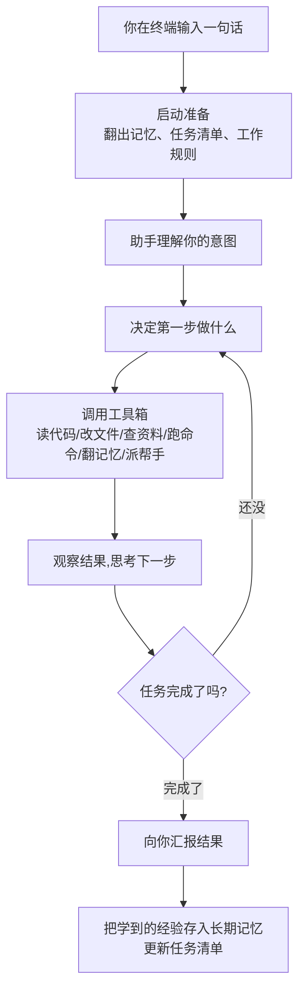
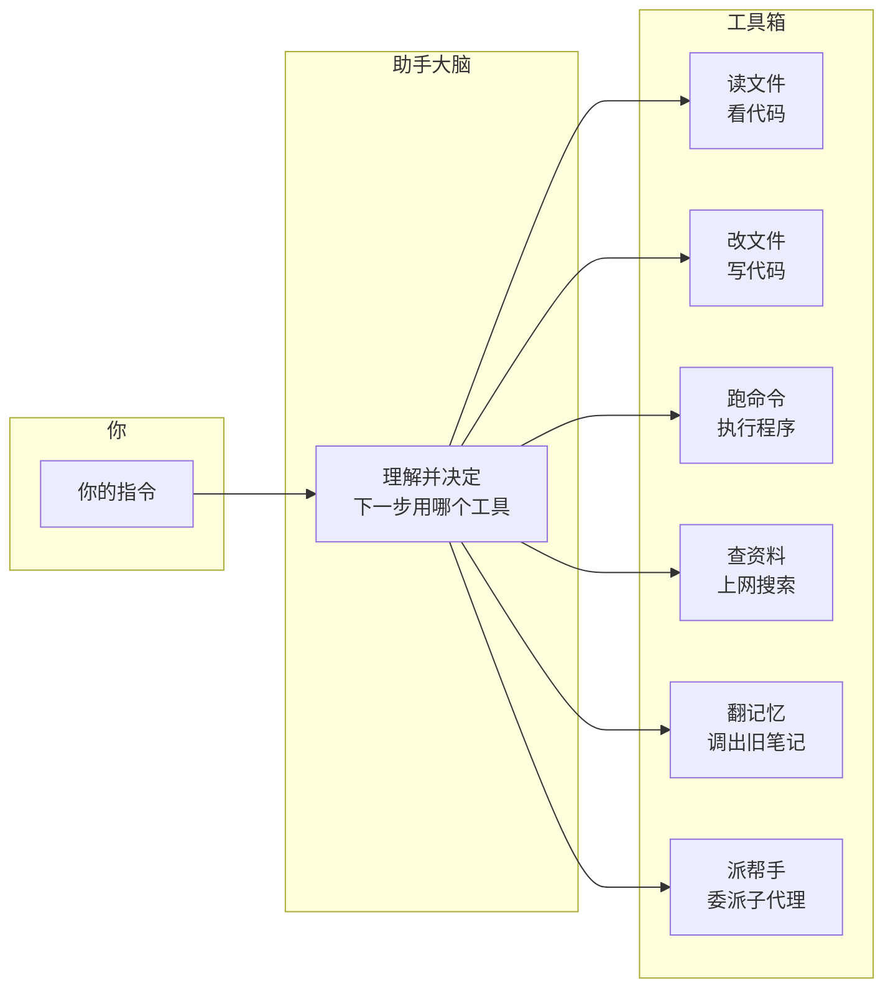
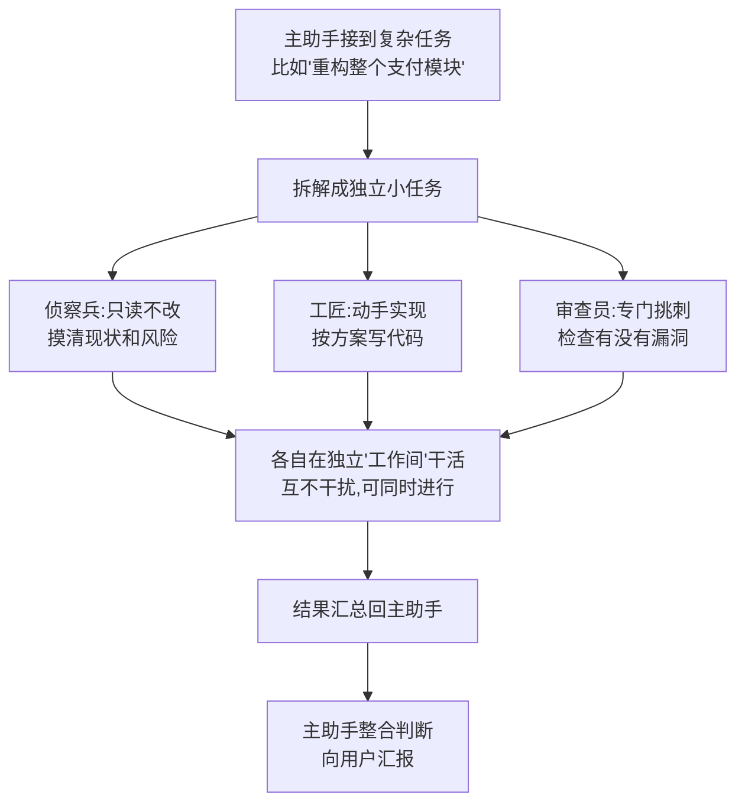
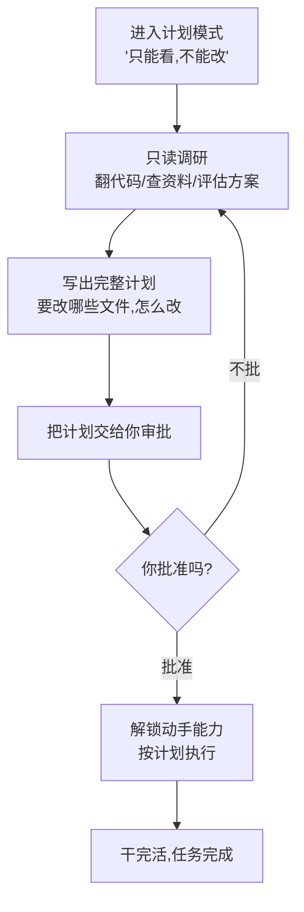
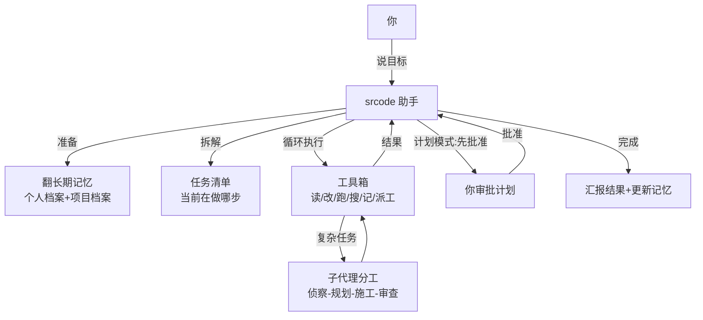

# 认识 srcode：住在你电脑里的 AI 编程助手

## 一、它是什么？

想象你请了一位**懂编程的助手**，它不坐在你旁边，而是住在你的电脑里。你打开一个普通的"终端"窗口（一个黑底白字的对话框），用**大白话**告诉它："帮我修一下登录页的 bug"、"给这个项目写个使用说明"，它就开始自己干活：翻看你的代码、思考问题出在哪、动手修改、再自己检查一遍，最后向你汇报。

这位助手就是 **srcode**。

它的全称是"srcode 编程代理"——"代理"这个词听起来唬人，其实意思很简单：**它能代表你、替你执行任务**。你只需要说清楚想要什么，具体怎么做、中间要查哪些资料、改哪些文件，都由它自己决定。

而且，它不只是一个"听话的输入输出工具"，它有几个很"聪明"的地方：

- **记性好**：它记得你上次说过"我更喜欢用 X 方案"，下次就主动按你的习惯来；
- **会分工**：任务复杂时，它会把工作拆开，让"侦察兵""工匠""审查员"几个角色同时开工；
- **守规矩**：动手改东西之前，它会先跟你确认，不会擅作主张乱改一通。

---

## 二、它解决什么问题？

写代码这件事，大部分时间其实不是"写"，而是：翻文档、找代码、试错、改 bug、检查有没有改坏。这些活又碎又耗时。

srcode 想做的事就是：**把"动手干"的部分包下来，你只负责"说清楚想要什么"和"最后把关"**。

它的核心价值可以浓缩成三句话：

1. **省时间**——读代码、查资料、跑测试这类跑腿活，它一口气做完；
2. **有记忆**——不用每次重新交代你的偏好和项目的来龙去脉；
3. **可放心**——有任务清单跟踪进度、有批准流程把住安全关，不会失控。

---

## 三、它整体是怎么运作的？

一句话概括：**你说话，它干活，边干边确认，干完来汇报。**

下面这张图是它完成一次任务的完整流程，也是整篇文章的"骨架图"，后面每一节都能在这张图上找到对应位置：



拆开看，就是五个环节：

**① 你说话**——在终端里输入一句普通中文或英文，比如"帮我把项目里所有没用到的文件找出来"。

**② 它做准备**——开工前，它先"翻自己的笔记本"：有没有你以前交代过的偏好？这个项目之前定过什么规矩？上次干到一半的任务清单还在不在？把该带的背景都带上。

**③ 它思考**——它像一个经验丰富的人一样，把大目标拆成小步骤，决定先看哪、再改哪。

**④ 它动手（循环）**——这是最核心的一环：**想一步、做一步、看结果、再想下一步**，反复循环，直到目标完成。就像你修东西时"拧一下螺丝、看看、再拧"。

**⑤ 它收尾**——干完活向你汇报，同时把这次学到的东西（比如"这个项目打包用 bun"）记进长期记忆，下次直接用。

---

## 四、它的"手脚"：工具箱里有什么？

助手能干活，靠的是一整套"工具"。你可以把它们想象成工具箱里的不同工具，每一样都有专门用途：



逐个说人话：

- **读文件**：打开你项目里的代码，一行行看，弄明白现状；
- **改文件**：找到问题后直接修改，保存；
- **跑命令**：在电脑上执行操作，比如"运行一遍测试，看看有没有报错"；
- **查资料**：遇到不确定的技术问题，上网搜最新资料（它默认用公开搜索，不花钱）；
- **翻记忆**：调用它自己的长期记忆，看看以前记过什么；
- **派帮手**：活太多时，启动"子代理"分工（下一节细讲）。

更贴心的是，它还有"代码放大镜"功能：能直接读懂你项目里"某个函数被谁调用过、改它会影响哪些地方"——相当于**看代码时自动高亮出所有关联点**，大大降低改错东西的风险。

---

## 五、它记性好：长期记忆怎么工作？

普通聊天机器人是"聊完就忘"的——每次对话都是重新开始。srcode 不是，它有一本**属于自己的长期笔记本**，存在你电脑本地的一个小文件里。

```mermaid
flowchart TD
    A[对话中产生新信息<br/>你说了偏好/项目做了决定/踩了坑] --> B{值得记吗?}
    B -- 你主动说"记住这个" --> C[手动记入笔记本]
    B -- 助手自动发现<br/>比如'我更喜欢…','项目决定用…' --> C
    C --> D[笔记本长期保存]
    D --> E[下次对话开始时<br/>自动翻出相关内容]
    E --> F[回答问题时先参考记忆<br/>比如主动用你偏好的方案]
    F --> G[你确认'这样对'<br/>该条记忆的'信任分'提高]
```

三个关键设计，值得展开：

**1. 它记得住"你"**。你说过"我写代码喜欢简洁风格"，它会记下来，下次主动按简洁风格来。你纠正过它一次（"不对，应该用 X 方案"），它会把这个纠正记成一条高优先级笔记，下次不再犯。

**2. 它分得清"全局"和"这个项目"**。你告诉它"我讨厌喝咖啡"——这属于你个人的事，任何项目里都适用；你告诉它"这个项目用 bun 打包"——这属于**当前这个项目**的事，换一个项目它就不会乱套用。笔记分了两本：一本是你的个人档案，一本是项目档案。

**3. 记忆不是"永久正确"**。它给每条记忆打"信任分"：被你确认过、反复用到的，分数高，优先参考；被你否定的，分数降低，慢慢沉底。所以记忆会**随你的反馈自我修正**，越用越准。

---

## 六、它会分工：子代理是怎么协作的？

面对复杂的任务，一个人从头干到尾容易顾此失彼。srcode 的做法是：**大任务拆小，交给不同专长的"小助手"（子代理）分头干，最后汇总**。



打个比方：你请装修队。**侦察兵**先量房、查管线（只调查，不动手）；**规划师**出方案；**工匠**按方案施工；**审查员**最后验收，不合格就打回重做。几个角色各干各的，效率高，而且每步都有专人把关。

子代理还有一道"验收关"：如果任务的验收标准写得很明确（比如"跑完测试必须全绿"），主助手会真的去跑一遍验证，**过不了关就自动打回让工匠返工**，而不是草草收工。

---

## 七、它守规矩：动手前先商量

改代码是有风险的——改错了可能让整个项目跑不起来。所以 srcode 有一个"**先看后动**"的计划模式，像个审批流程：



在你点头之前，它**只有眼睛没有手**：能看代码、能查资料，但不能改动任何文件。计划写好后弹出来给你过目，你觉得不行就打回重想，觉得可以才放行。

这个设计特别适合两类场景：**第一次接触的新项目**（先看清楚再动手）和**自动化批量任务**（设定好规则，无人值守时也先出计划再执行）。

---

## 八、它怎么"落地"：从安装到你用上

你可能会问：这东西装起来麻烦吗？用起来门槛高吗？

**安装**：它需要你的电脑上有一个叫 Bun 的现代运行环境（相当于给助手铺好"宿舍"），然后一条命令就能装好——整个安装向导是菜单式问答，跟着提示选就行，不需要懂任何代码。

**使用**：打开终端，敲一个命令启动它，然后……就用中文聊天。

**日常长什么样**：
- 屏幕上有你的对话区、任务清单小面板（哪些活干完了、哪些进行中，一目了然）；
- 它干活时每一步用了什么工具、看了什么文件，都会实时显示，你可以随时"旁听"；
- 想打断或纠正，直接打字就行；
- 干完的活它会总结，你想存档就存档。

**安全护栏**（简单提三点）：
1. 项目自带的配置（比如它要执行项目里约定的命令）**默认不自动生效**，需要你明确开开关；
2. 无人值守模式下，涉及执行项目自带脚本的操作**默认拒绝**，除非你显式授权；
3. 你的密钥类信息**不会写进记忆**，它自带"敏感信息扫描"，看到像密码、密钥的内容直接拒绝保存，而且保存的配置文件权限也做了收紧。

---

## 九、最后：一张图串起全部

如果你只记住一件事，就记这张图——它把 srcode 的完整工作模式浓缩在一起：



**一句话总结**：srcode 是一位住在你电脑里、记性好、会分工、守规矩的 AI 编程助手——你说清想要什么，它负责把"查、想、改、验"的活儿干完，把时间还给你，把把关权留给你。

---

*如果你恰好会一点编程，它还能更进一步：自定义它的小助手角色（比如"专门写测试的专家"）、接入你自己配置的外部工具服务、甚至让你项目里的队友共用同一套约定。但即便你完全不懂这些——把它当成一个"特别靠谱、记得住事、动手前先请示"的编程帮手，就够了。*
